# Architecture Documentation

> Comprehensive architecture guide for the enterprise fullstack scaffold

**Author:** Homero Thompson del Lago del Terror
**Last Updated:** 2026-01-19

---

## Table of Contents

- [Overview](#overview)
- [Monorepo Structure](#monorepo-structure)
- [Application Architecture](#application-architecture)
- [Data Flow](#data-flow)
- [API Communication Patterns](#api-communication-patterns)
- [Database Layer](#database-layer)
- [Package Architecture](#package-architecture)
- [Scaling Patterns](#scaling-patterns)

---

## Overview

This scaffold implements a **modern monorepo architecture** using:

- **Turborepo** - Build orchestration and caching
- **pnpm workspaces** - Dependency management
- **Shared packages** - Code reuse across apps
- **Multiple backends** - Support for FastAPI, NestJS, or API-less (Supabase)
- **Modern frontend** - Next.js 14+ with App Router

### Key Architectural Principles

| Principle | Implementation |
|-----------|----------------|
| **Separation of Concerns** | Apps vs Packages separation |
| **DRY (Don't Repeat Yourself)** | Shared packages for common logic |
| **Modularity** | Each app/package is independently deployable |
| **Type Safety** | End-to-end TypeScript with Zod validation |
| **API Contracts** | OpenAPI/GraphQL schemas as source of truth |

---

## Monorepo Structure

```
nuevo-proyecto/
├── apps/
│   ├── web/                    # Next.js frontend
│   │   ├── app/               # App Router pages
│   │   ├── components/        # React components
│   │   ├── lib/               # Client utilities
│   │   └── public/            # Static assets
│   │
│   └── api/                   # Backend (FastAPI or NestJS)
│       ├── src/
│       │   ├── routes/        # API endpoints
│       │   ├── models/        # Data models
│       │   ├── services/      # Business logic
│       │   └── middleware/    # Auth, logging, etc.
│       └── tests/
│
├── packages/
│   ├── ui/                    # Shared UI components (React)
│   ├── config/                # Shared configs (ESLint, TS, Tailwind)
│   ├── database/              # Database schemas & migrations
│   ├── api-client/            # Type-safe API client
│   ├── validation/            # Zod schemas
│   └── utils/                 # Shared utilities
│
├── turbo.json                 # Turborepo config
├── pnpm-workspace.yaml        # Workspace definition
└── package.json               # Root package
```

### Workspace Dependency Graph

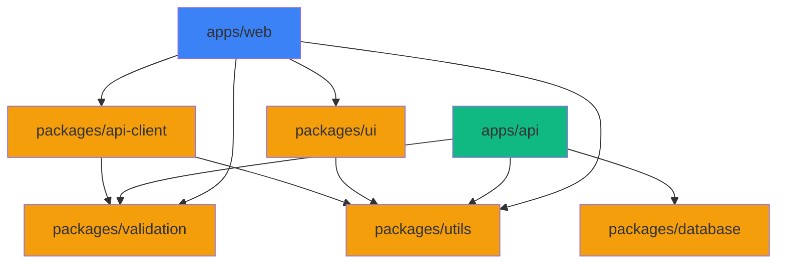

---

## Application Architecture

### Frontend Architecture (apps/web)

```
apps/web/
├── app/                       # Next.js App Router
│   ├── (auth)/               # Auth route group
│   ├── (dashboard)/          # Protected routes
│   ├── api/                  # API routes (BFF pattern)
│   └── layout.tsx            # Root layout
│
├── components/
│   ├── ui/                   # Shadcn components
│   ├── features/             # Feature-specific components
│   └── layouts/              # Layout components
│
├── lib/
│   ├── api/                  # API client wrapper
│   ├── auth/                 # Auth utilities
│   ├── hooks/                # Custom React hooks
│   └── utils/                # Helper functions
│
└── styles/
    └── globals.css           # Tailwind + custom styles
```

#### Component Architecture Pattern

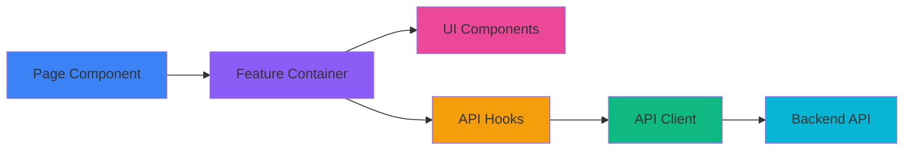

### Backend Architecture (apps/api)

#### FastAPI Variant

```
apps/api/
├── src/
│   ├── main.py               # App initialization
│   ├── config.py             # Settings (pydantic-settings)
│   ├── routes/               # API endpoints
│   │   ├── auth.py
│   │   ├── users.py
│   │   └── ...
│   ├── models/               # SQLModel/Pydantic models
│   ├── services/             # Business logic layer
│   ├── repositories/         # Data access layer
│   ├── middleware/           # Auth, CORS, logging
│   └── exceptions.py         # Custom exceptions
└── tests/
    ├── unit/
    ├── integration/
    └── e2e/
```

#### NestJS Variant

```
apps/api/
├── src/
│   ├── main.ts               # Bootstrap
│   ├── app.module.ts         # Root module
│   ├── auth/                 # Auth module
│   │   ├── auth.controller.ts
│   │   ├── auth.service.ts
│   │   ├── auth.module.ts
│   │   └── guards/
│   ├── users/                # Users module
│   └── common/               # Shared code
│       ├── decorators/
│       ├── filters/
│       └── interceptors/
└── test/
```

#### Go Variant

```
apps/api/
├── cmd/
│   └── api/
│       └── main.go           # Entry point
├── internal/
│   ├── config/               # Configuration
│   ├── handlers/             # HTTP handlers
│   ├── models/               # Data models
│   ├── repository/           # Data access
│   ├── services/             # Business logic
│   ├── middleware/           # Auth, logging, etc.
│   └── utils/                # Utilities
├── pkg/                      # Public packages
├── migrations/               # Database migrations
└── go.mod
```

**Best for:**
- High-performance APIs
- Concurrent workloads
- Systems programming
- Microservices (Go's strength)

**Key features:**
- Native concurrency (goroutines)
- Fast compilation and execution
- Strong typing
- Excellent standard library

---

## Data Flow

### Request/Response Flow

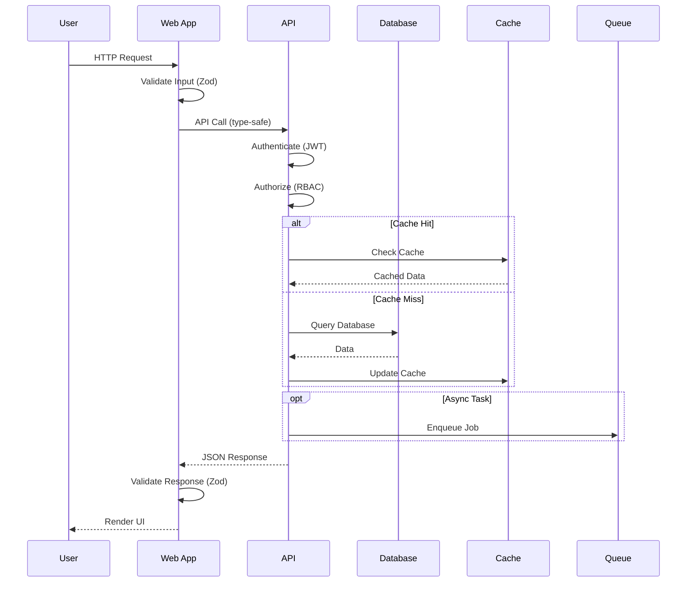

### State Management Flow

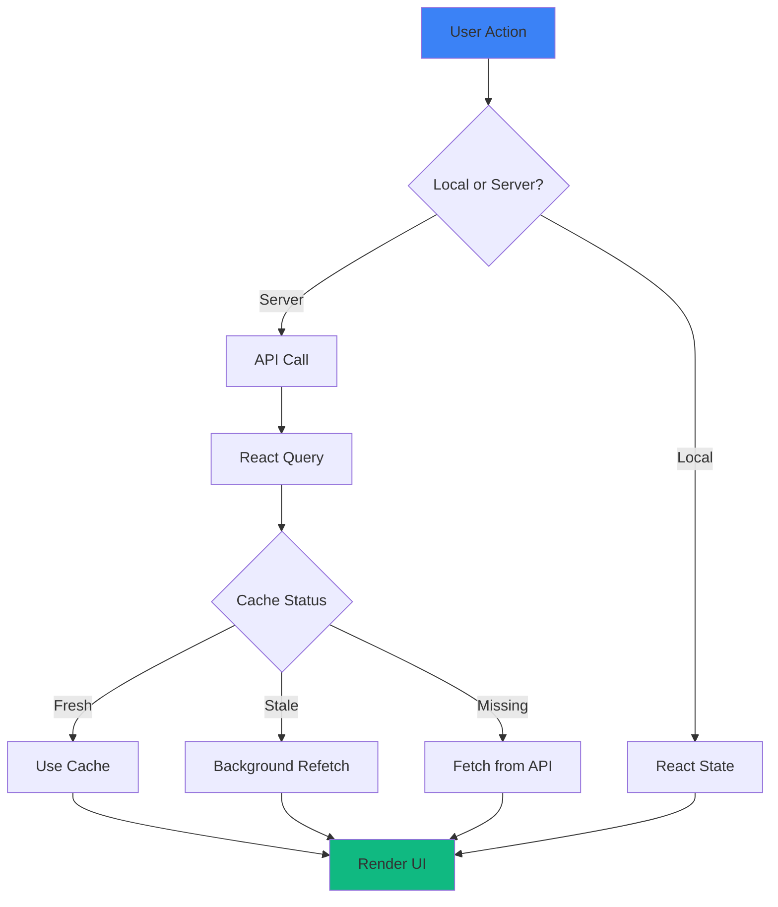

---

## API Communication Patterns

### Supported Patterns

| Pattern | Use Case | Implementation |
|---------|----------|----------------|
| **REST** | Standard CRUD operations | FastAPI/NestJS/Go endpoints |
| **GraphQL** | Complex data fetching | Apollo Server / gqlgen (Go) |
| **gRPC** | Microservice communication | gRPC (all backends) |
| **tRPC** | Full-stack type safety | tRPC monorepo setup |
| **WebSockets** | Real-time features | Socket.io / Server-Sent Events |

### REST API Pattern (Default)

```typescript
// packages/api-client/src/users.ts
import { z } from 'zod';
import { apiClient } from './client';

const UserSchema = z.object({
  id: z.number(),
  email: z.string().email(),
  name: z.string(),
});

export type User = z.infer<typeof UserSchema>;

export const usersApi = {
  async getUser(id: number): Promise<User> {
    const response = await apiClient.get(`/users/${id}`);
    return UserSchema.parse(response.data);
  },

  async listUsers(): Promise<User[]> {
    const response = await apiClient.get('/users');
    return z.array(UserSchema).parse(response.data);
  },
};
```

### tRPC Pattern (Full-stack Type Safety)

**Architecture:**
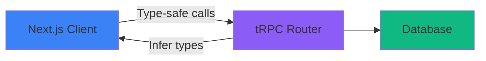

**Backend (tRPC Router):**
```typescript
// apps/api/src/trpc/router.ts
import { z } from 'zod';
import { router, publicProcedure, protectedProcedure } from './trpc';

export const appRouter = router({
  user: {
    getById: publicProcedure
      .input(z.number())
      .query(async ({ input, ctx }) => {
        return ctx.db.user.findUnique({ where: { id: input } });
      }),

    create: protectedProcedure
      .input(z.object({
        email: z.string().email(),
        name: z.string().min(2),
      }))
      .mutation(async ({ input, ctx }) => {
        return ctx.db.user.create({ data: input });
      }),
  },
});

export type AppRouter = typeof appRouter;
```

**Frontend (Type-safe Client):**
```typescript
// apps/web/lib/trpc.ts
import { createTRPCReact } from '@trpc/react-query';
import type { AppRouter } from '@/api/trpc/router';

export const trpc = createTRPCReact<AppRouter>();

// Usage in component - fully type-safe!
const { data: user } = trpc.user.getById.useQuery(1);
const createUser = trpc.user.create.useMutation();
```

**Key Benefits:**
- End-to-end type safety (no code generation needed)
- Autocomplete everywhere
- Refactor-safe (rename in one place updates everywhere)
- RPC-like developer experience with REST benefits

### gRPC Pattern (Microservices)

**Architecture:**
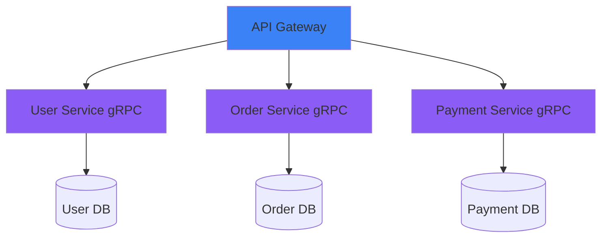

**Protocol Definition:**
```protobuf
// proto/user.proto
syntax = "proto3";

package user;

service UserService {
  rpc GetUser (GetUserRequest) returns (UserResponse);
  rpc CreateUser (CreateUserRequest) returns (UserResponse);
  rpc ListUsers (ListUsersRequest) returns (stream UserResponse);
}

message GetUserRequest {
  int64 id = 1;
}

message UserResponse {
  int64 id = 1;
  string email = 2;
  string name = 3;
  string created_at = 4;
}
```

**Go Implementation:**
```go
// internal/grpc/user_service.go
type UserService struct {
    pb.UnimplementedUserServiceServer
    repo *repository.UserRepository
}

func (s *UserService) GetUser(ctx context.Context, req *pb.GetUserRequest) (*pb.UserResponse, error) {
    user, err := s.repo.FindByID(ctx, req.Id)
    if err != nil {
        return nil, status.Errorf(codes.NotFound, "user not found")
    }

    return &pb.UserResponse{
        Id:        user.ID,
        Email:     user.Email,
        Name:      user.Name,
        CreatedAt: user.CreatedAt.Format(time.RFC3339),
    }, nil
}
```

**NestJS Implementation:**
```typescript
// src/users/users.controller.ts
@Controller()
export class UsersController {
  @GrpcMethod('UserService', 'GetUser')
  async getUser(data: GetUserRequest): Promise<UserResponse> {
    const user = await this.usersService.findOne(data.id);
    return {
      id: user.id,
      email: user.email,
      name: user.name,
      createdAt: user.createdAt.toISOString(),
    };
  }
}
```

**Key Benefits:**
- High performance (binary protocol)
- Bidirectional streaming
- Strong typing via protobuf
- Multi-language support
- Perfect for microservices

### GraphQL Pattern (Flexible Queries)

**Schema Definition:**
```graphql
# schema.graphql
type User {
  id: ID!
  email: String!
  name: String!
  posts: [Post!]!
  createdAt: DateTime!
}

type Post {
  id: ID!
  title: String!
  content: String!
  author: User!
}

type Query {
  user(id: ID!): User
  users(limit: Int, offset: Int): [User!]!
}

type Mutation {
  createUser(email: String!, name: String!): User!
}
```

**Go Implementation (gqlgen):**
```go
// internal/graphql/resolver.go
func (r *queryResolver) User(ctx context.Context, id string) (*model.User, error) {
    userID, _ := strconv.ParseInt(id, 10, 64)
    return r.UserService.GetByID(ctx, userID)
}

func (r *mutationResolver) CreateUser(ctx context.Context, email, name string) (*model.User, error) {
    return r.UserService.Create(ctx, email, name)
}
```

**NestJS Implementation (Apollo):**
```typescript
// src/users/users.resolver.ts
@Resolver(() => User)
export class UsersResolver {
  @Query(() => User)
  async user(@Args('id') id: string) {
    return this.usersService.findOne(id);
  }

  @Mutation(() => User)
  async createUser(@Args('input') input: CreateUserInput) {
    return this.usersService.create(input);
  }
}
```

**Key Benefits:**
- Client specifies exact data needed
- Single endpoint
- Reduces over-fetching
- Strong typing
- Excellent for mobile/web apps

### API Contract Validation Flow

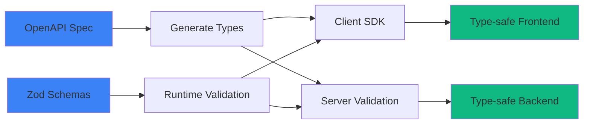

---

## Database Layer

### Architecture Options

#### Option 1: Direct Database (FastAPI/NestJS)

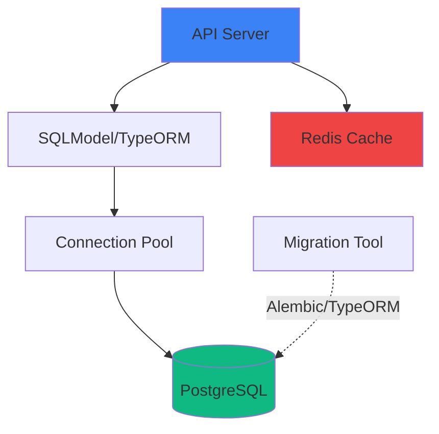

```python
# packages/database/models/user.py
from sqlmodel import SQLModel, Field
from typing import Optional

class User(SQLModel, table=True):
    """User model."""
    id: Optional[int] = Field(default=None, primary_key=True)
    email: str = Field(unique=True, index=True)
    hashed_password: str
    name: str
    is_active: bool = Field(default=True)
```

#### Option 2: Supabase (API-less)

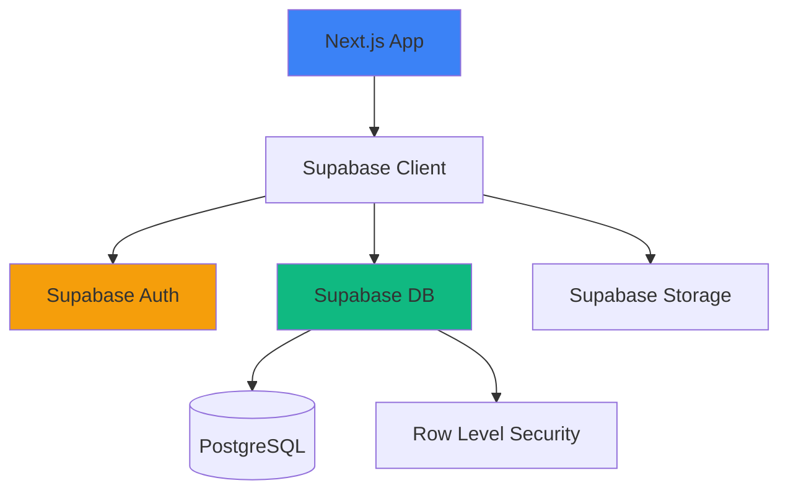

```typescript
// packages/database/supabase/schema.sql
create table users (
  id bigint generated always as identity primary key,
  email text unique not null,
  name text not null,
  created_at timestamp with time zone default now()
);

-- Row Level Security
alter table users enable row level security;

create policy "Users can view own data"
  on users for select
  using (auth.uid() = id);
```

#### Option 3: MongoDB (Document-based)

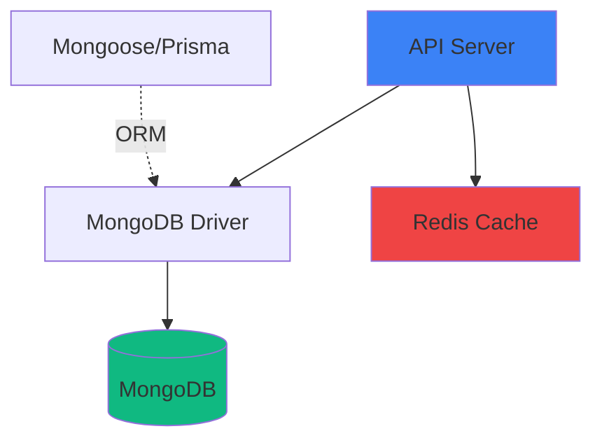

**Schema Definition (Mongoose):**
```typescript
// packages/database/models/user.ts
import { Schema, model } from 'mongoose';

const userSchema = new Schema({
  email: {
    type: String,
    required: true,
    unique: true,
    lowercase: true,
    trim: true,
  },
  name: { type: String, required: true },
  passwordHash: { type: String, required: true },
  role: {
    type: String,
    enum: ['user', 'admin'],
    default: 'user'
  },
  profile: {
    avatar: String,
    bio: String,
    location: String,
  },
  createdAt: { type: Date, default: Date.now },
  updatedAt: { type: Date, default: Date.now },
});

// Indexes for performance
userSchema.index({ email: 1 });
userSchema.index({ createdAt: -1 });

export const User = model('User', userSchema);
```

**Go Implementation (official driver):**
```go
// internal/models/user.go
type User struct {
    ID           primitive.ObjectID `bson:"_id,omitempty" json:"id"`
    Email        string             `bson:"email" json:"email"`
    Name         string             `bson:"name" json:"name"`
    PasswordHash string             `bson:"password_hash" json:"-"`
    Role         string             `bson:"role" json:"role"`
    Profile      UserProfile        `bson:"profile" json:"profile"`
    CreatedAt    time.Time          `bson:"created_at" json:"createdAt"`
    UpdatedAt    time.Time          `bson:"updated_at" json:"updatedAt"`
}

type UserProfile struct {
    Avatar   string `bson:"avatar,omitempty" json:"avatar,omitempty"`
    Bio      string `bson:"bio,omitempty" json:"bio,omitempty"`
    Location string `bson:"location,omitempty" json:"location,omitempty"`
}
```

**Best for:**
- Flexible schemas
- Document-based data
- Rapid prototyping
- Hierarchical data
- High write throughput

**When to use MongoDB:**
- Schema changes frequently
- Nested/embedded documents
- Horizontal scaling needs
- JSON-like data structures

### Migration Strategy

```bash
# Alembic (FastAPI)
alembic revision --autogenerate -m "Add users table"
alembic upgrade head

# TypeORM (NestJS)
npm run typeorm migration:generate -- -n AddUsersTable
npm run typeorm migration:run

# Supabase
supabase db push
```

---

## Package Architecture

### Shared Package Structure

```
packages/ui/
├── src/
│   ├── components/           # React components
│   │   ├── button.tsx
│   │   ├── card.tsx
│   │   └── ...
│   ├── hooks/                # Custom hooks
│   └── index.ts              # Barrel export
├── package.json
└── tsconfig.json
```

### Package Dependencies

```json
{
  "name": "@repo/ui",
  "version": "0.0.0",
  "exports": {
    ".": "./src/index.ts",
    "./styles": "./src/styles/index.css"
  },
  "dependencies": {
    "react": "^18.2.0",
    "@repo/utils": "workspace:*"
  }
}
```

### Cross-Package Type Safety

```typescript
// packages/validation/src/user.ts
import { z } from 'zod';

export const CreateUserSchema = z.object({
  email: z.string().email(),
  name: z.string().min(2),
  password: z.string().min(8),
});

export type CreateUserInput = z.infer<typeof CreateUserSchema>;
```

```typescript
// apps/api/src/routes/users.py (FastAPI)
from pydantic import BaseModel

class CreateUserInput(BaseModel):
    """Mirrors Zod schema from packages/validation."""
    email: str
    name: str
    password: str
```

---

## Scaling Patterns

### Horizontal Scaling

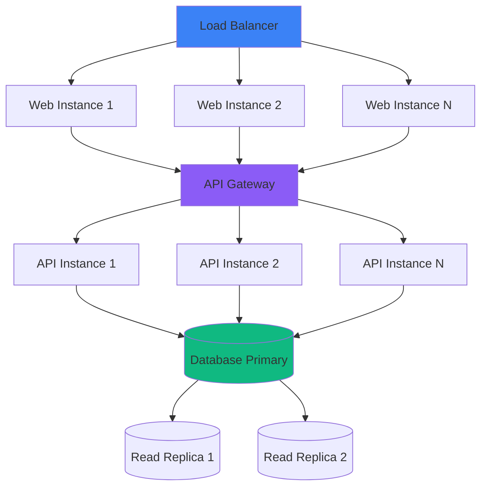

### Microservices Evolution

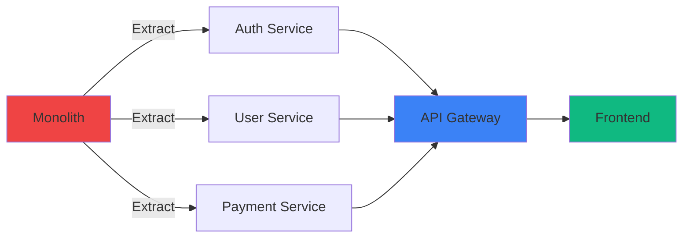

### Caching Strategy

| Layer | Technology | TTL | Use Case |
|-------|------------|-----|----------|
| **CDN** | Cloudflare/CloudFront | 1h-24h | Static assets |
| **Application** | Redis | 5m-1h | API responses |
| **Database** | PostgreSQL shared_buffers | N/A | Query results |
| **Client** | React Query | 30s-5m | UI state |

---

## Redis Caching Patterns

### Cache Architectures

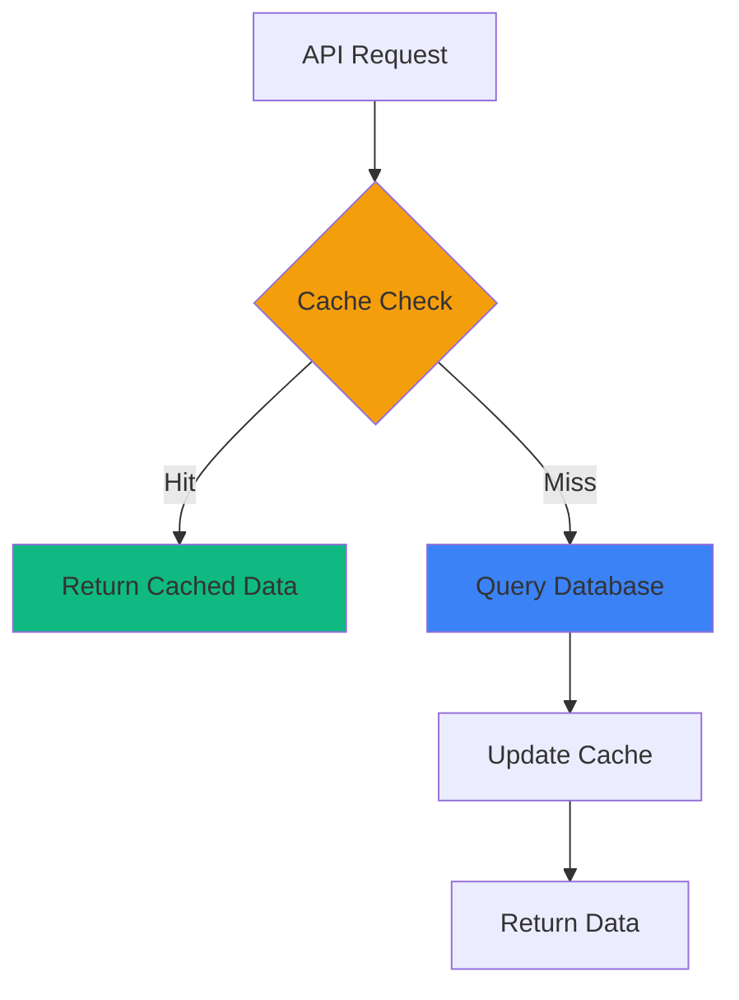

### Pattern 1: Cache-Aside (Lazy Loading)

**Most common pattern - application manages cache.**

```typescript
// NestJS implementation
async getUser(id: number): Promise<User> {
  const cacheKey = `user:${id}`;

  // 1. Check cache
  const cached = await this.redis.get(cacheKey);
  if (cached) {
    return JSON.parse(cached);
  }

  // 2. Query database
  const user = await this.db.user.findUnique({ where: { id } });

  // 3. Update cache
  await this.redis.setex(cacheKey, 3600, JSON.stringify(user));

  return user;
}
```

```go
// Go implementation
func (s *UserService) GetUser(ctx context.Context, id int64) (*User, error) {
    cacheKey := fmt.Sprintf("user:%d", id)

    // 1. Check cache
    cached, err := s.redis.Get(ctx, cacheKey).Result()
    if err == nil {
        var user User
        json.Unmarshal([]byte(cached), &user)
        return &user, nil
    }

    // 2. Query database
    user, err := s.repo.FindByID(ctx, id)
    if err != nil {
        return nil, err
    }

    // 3. Update cache
    userJSON, _ := json.Marshal(user)
    s.redis.Set(ctx, cacheKey, userJSON, time.Hour)

    return user, nil
}
```

**Best for:** Read-heavy workloads, flexible caching

### Pattern 2: Write-Through Cache

**Cache is updated immediately on write.**

```typescript
async updateUser(id: number, data: UpdateUserDto): Promise<User> {
  // 1. Update database
  const user = await this.db.user.update({
    where: { id },
    data,
  });

  // 2. Update cache immediately
  const cacheKey = `user:${id}`;
  await this.redis.setex(cacheKey, 3600, JSON.stringify(user));

  // 3. Invalidate related caches
  await this.redis.del(`users:list:*`);

  return user;
}
```

**Best for:** Consistency-critical data, moderate write load

### Pattern 3: Write-Behind (Write-Back) Cache

**Cache updated first, database async.**

```typescript
async incrementCounter(key: string): Promise<number> {
  // 1. Update cache immediately
  const newValue = await this.redis.incr(`counter:${key}`);

  // 2. Queue database update
  await this.jobQueue.add('updateCounter', {
    key,
    value: newValue,
  });

  return newValue;
}
```

**Best for:** High write throughput, eventual consistency acceptable

### Pattern 4: Cache Invalidation Strategies

**Time-based (TTL):**
```typescript
// Short TTL for frequently changing data
await redis.setex('stock:AAPL', 60, price); // 1 minute

// Long TTL for static data
await redis.setex('user:profile:123', 86400, profile); // 24 hours
```

**Event-based:**
```typescript
// Invalidate on user update
@OnEvent('user.updated')
async handleUserUpdated(payload: UserUpdatedEvent) {
  await this.redis.del(`user:${payload.userId}`);
  await this.redis.del(`users:list:*`);
}
```

**Pattern-based:**
```typescript
// Invalidate all keys matching pattern
await redis.eval(`
  local keys = redis.call('keys', ARGV[1])
  for i=1,#keys,5000 do
    redis.call('del', unpack(keys, i, math.min(i+4999, #keys)))
  end
`, 0, 'users:*');
```

### Pattern 5: Cache Warming

**Pre-populate cache with frequently accessed data.**

```typescript
@Cron('0 */6 * * *') // Every 6 hours
async warmCache() {
  // Warm popular users
  const popularUsers = await this.db.user.findMany({
    where: { followers: { gt: 10000 } },
  });

  for (const user of popularUsers) {
    await this.redis.setex(
      `user:${user.id}`,
      3600,
      JSON.stringify(user)
    );
  }
}
```

### Redis Data Structures for Caching

| Structure | Use Case | Example |
|-----------|----------|---------|
| **String** | Simple cache | `user:123` → JSON |
| **Hash** | Structured data | `user:123` → {name, email, ...} |
| **List** | Activity feeds | `timeline:user:123` → [post_ids] |
| **Set** | Unique collections | `followers:123` → {user_ids} |
| **Sorted Set** | Leaderboards | `leaderboard` → {user:score} |
| **Bitmap** | Analytics | `daily_active:2024-01-19` → bitmap |
| **HyperLogLog** | Unique counts | `unique_visitors` → count estimate |

### Cache Configuration Examples

**Development:**
```yaml
redis:
  host: localhost
  port: 6379
  maxmemory: 256mb
  maxmemory-policy: allkeys-lru
```

**Production:**
```yaml
redis:
  cluster:
    - host: redis-1.example.com
    - host: redis-2.example.com
    - host: redis-3.example.com
  maxmemory: 4gb
  maxmemory-policy: volatile-lru
  persistence: AOF
  replication: enabled
```

### Cache Monitoring

**Key metrics to track:**
```typescript
// Cache hit rate
const hits = await redis.get('stats:cache:hits');
const misses = await redis.get('stats:cache:misses');
const hitRate = hits / (hits + misses);

// Memory usage
const info = await redis.info('memory');

// Evictions
const evictions = await redis.info('stats').evicted_keys;
```

---

## Performance Optimization

### Build Performance

```javascript
// turbo.json
{
  "pipeline": {
    "build": {
      "dependsOn": ["^build"],
      "outputs": [".next/**", "dist/**"],
      "cache": true
    },
    "test": {
      "cache": true,
      "inputs": ["src/**", "tests/**"]
    }
  }
}
```

### Runtime Performance

| Strategy | Implementation | Impact |
|----------|----------------|--------|
| **Code Splitting** | Next.js dynamic imports | -40% initial bundle |
| **Image Optimization** | next/image | -60% bandwidth |
| **API Response Caching** | Redis | -80% DB load |
| **Database Indexing** | Proper indexes | -90% query time |
| **Edge Functions** | Vercel/Cloudflare | -200ms latency |

---

## Cross-References

| Topic | Document |
|-------|----------|
| Security implementation | [SECURITY.md](./SECURITY.md) |
| Testing strategy | [TESTING.md](./TESTING.md) |
| Deployment patterns | [DEPLOYMENT.md](./DEPLOYMENT.md) |

---

**Version:** 4.0
**Last Updated:** 2026-01-19
