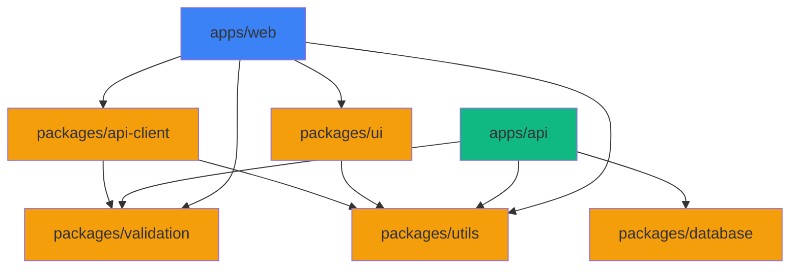
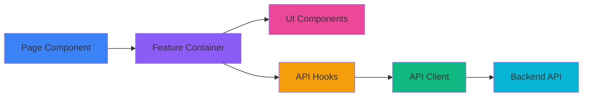
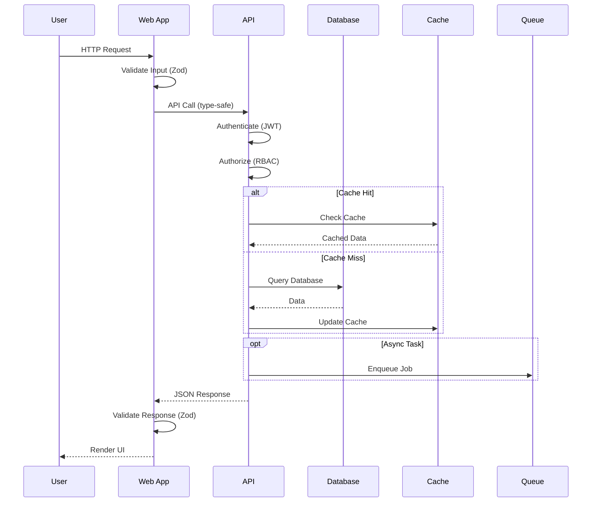
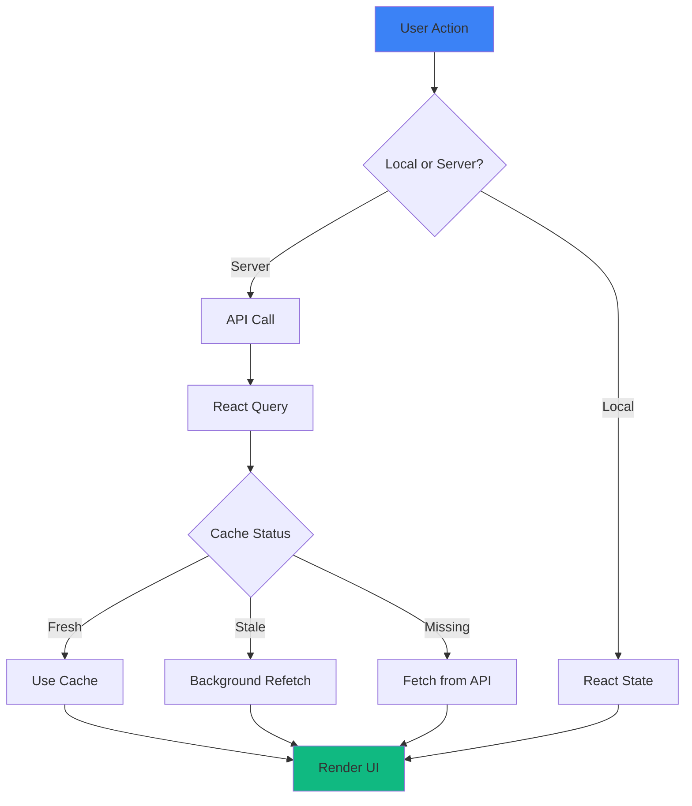
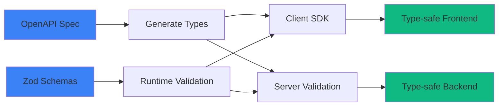
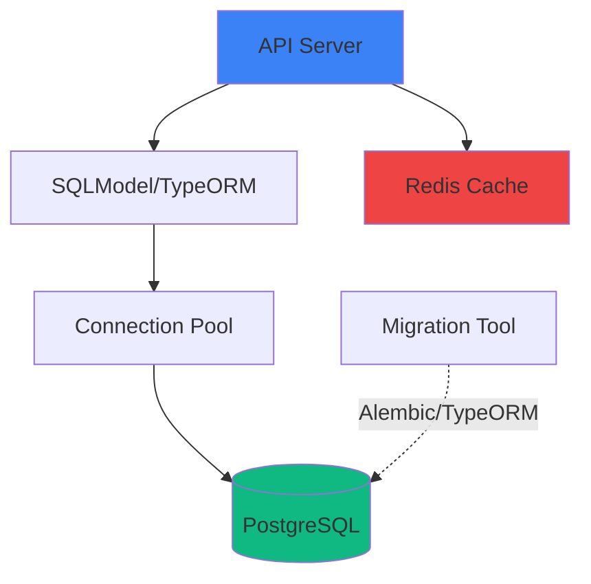
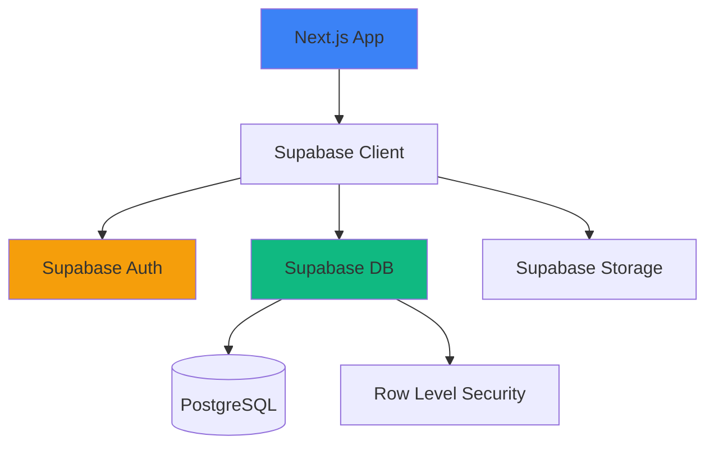
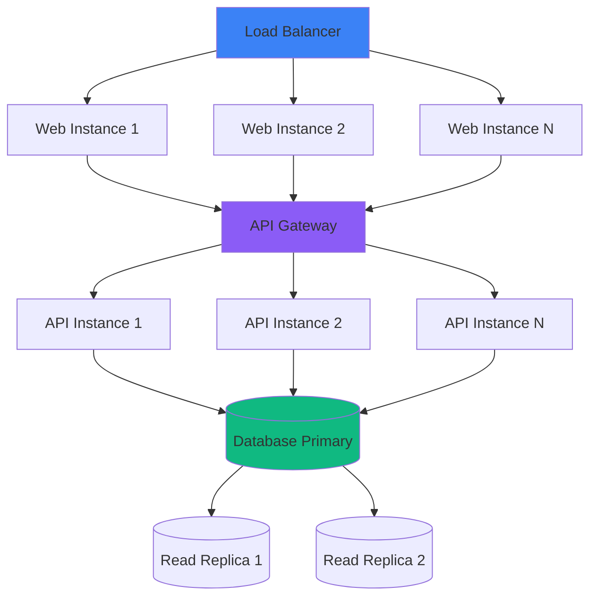
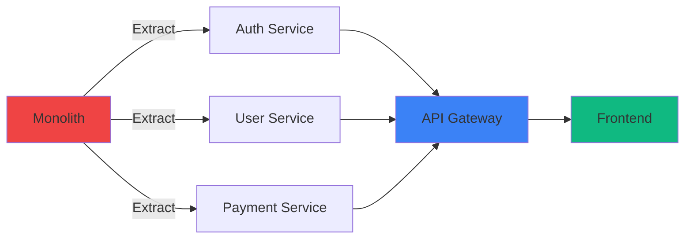

# Architecture Documentation

> Comprehensive architecture guide for the enterprise fullstack scaffold

**Author:** Homero Thompson del Lago del Terror
**Last Updated:** 2026-01-19

---

## Table of Contents

- [Overview](#overview)
- [Monorepo Structure](#monorepo-structure)
- [Application Architecture](#application-architecture)
- [Data Flow](#data-flow)
- [API Communication Patterns](#api-communication-patterns)
- [Database Layer](#database-layer)
- [Package Architecture](#package-architecture)
- [Scaling Patterns](#scaling-patterns)

---

## Overview

This scaffold implements a **modern monorepo architecture** using:

- **Turborepo** - Build orchestration and caching
- **pnpm workspaces** - Dependency management
- **Shared packages** - Code reuse across apps
- **Multiple backends** - Support for FastAPI, NestJS, or API-less (Supabase)
- **Modern frontend** - Next.js 14+ with App Router

### Key Architectural Principles

| Principle | Implementation |
|-----------|----------------|
| **Separation of Concerns** | Apps vs Packages separation |
| **DRY (Don't Repeat Yourself)** | Shared packages for common logic |
| **Modularity** | Each app/package is independently deployable |
| **Type Safety** | End-to-end TypeScript with Zod validation |
| **API Contracts** | OpenAPI/GraphQL schemas as source of truth |

---

## Monorepo Structure

```
nuevo-proyecto/
├── apps/
│   ├── web/                    # Next.js frontend
│   │   ├── app/               # App Router pages
│   │   ├── components/        # React components
│   │   ├── lib/               # Client utilities
│   │   └── public/            # Static assets
│   │
│   └── api/                   # Backend (FastAPI or NestJS)
│       ├── src/
│       │   ├── routes/        # API endpoints
│       │   ├── models/        # Data models
│       │   ├── services/      # Business logic
│       │   └── middleware/    # Auth, logging, etc.
│       └── tests/
│
├── packages/
│   ├── ui/                    # Shared UI components (React)
│   ├── config/                # Shared configs (ESLint, TS, Tailwind)
│   ├── database/              # Database schemas & migrations
│   ├── api-client/            # Type-safe API client
│   ├── validation/            # Zod schemas
│   └── utils/                 # Shared utilities
│
├── turbo.json                 # Turborepo config
├── pnpm-workspace.yaml        # Workspace definition
└── package.json               # Root package
```

### Workspace Dependency Graph



---

## Application Architecture

### Frontend Architecture (apps/web)

```
apps/web/
├── app/                       # Next.js App Router
│   ├── (auth)/               # Auth route group
│   ├── (dashboard)/          # Protected routes
│   ├── api/                  # API routes (BFF pattern)
│   └── layout.tsx            # Root layout
│
├── components/
│   ├── ui/                   # Shadcn components
│   ├── features/             # Feature-specific components
│   └── layouts/              # Layout components
│
├── lib/
│   ├── api/                  # API client wrapper
│   ├── auth/                 # Auth utilities
│   ├── hooks/                # Custom React hooks
│   └── utils/                # Helper functions
│
└── styles/
    └── globals.css           # Tailwind + custom styles
```

#### Component Architecture Pattern



### Backend Architecture (apps/api)

#### FastAPI Variant

```
apps/api/
├── src/
│   ├── main.py               # App initialization
│   ├── config.py             # Settings (pydantic-settings)
│   ├── routes/               # API endpoints
│   │   ├── auth.py
│   │   ├── users.py
│   │   └── ...
│   ├── models/               # SQLModel/Pydantic models
│   ├── services/             # Business logic layer
│   ├── repositories/         # Data access layer
│   ├── middleware/           # Auth, CORS, logging
│   └── exceptions.py         # Custom exceptions
└── tests/
    ├── unit/
    ├── integration/
    └── e2e/
```

#### NestJS Variant

```
apps/api/
├── src/
│   ├── main.ts               # Bootstrap
│   ├── app.module.ts         # Root module
│   ├── auth/                 # Auth module
│   │   ├── auth.controller.ts
│   │   ├── auth.service.ts
│   │   ├── auth.module.ts
│   │   └── guards/
│   ├── users/                # Users module
│   └── common/               # Shared code
│       ├── decorators/
│       ├── filters/
│       └── interceptors/
└── test/
```

---

## Data Flow

### Request/Response Flow



### State Management Flow



---

## API Communication Patterns

### Supported Patterns

| Pattern | Use Case | Implementation |
|---------|----------|----------------|
| **REST** | Standard CRUD operations | FastAPI/NestJS endpoints |
| **GraphQL** | Complex data fetching | Apollo Server (optional) |
| **gRPC** | Microservice communication | gRPC-node (optional) |
| **tRPC** | Full-stack type safety | tRPC monorepo setup |
| **WebSockets** | Real-time features | Socket.io / Server-Sent Events |

### REST API Pattern (Default)

```typescript
// packages/api-client/src/users.ts
import { z } from 'zod';
import { apiClient } from './client';

const UserSchema = z.object({
  id: z.number(),
  email: z.string().email(),
  name: z.string(),
});

export type User = z.infer<typeof UserSchema>;

export const usersApi = {
  async getUser(id: number): Promise<User> {
    const response = await apiClient.get(`/users/${id}`);
    return UserSchema.parse(response.data);
  },

  async listUsers(): Promise<User[]> {
    const response = await apiClient.get('/users');
    return z.array(UserSchema).parse(response.data);
  },
};
```

### tRPC Pattern (Optional)

```typescript
// apps/api/src/trpc/router.ts
import { z } from 'zod';
import { router, publicProcedure } from './trpc';

export const appRouter = router({
  user: {
    getById: publicProcedure
      .input(z.number())
      .query(async ({ input, ctx }) => {
        return ctx.db.user.findUnique({ where: { id: input } });
      }),
  },
});

export type AppRouter = typeof appRouter;
```

```typescript
// apps/web/lib/trpc.ts
import { createTRPCReact } from '@trpc/react-query';
import type { AppRouter } from '@/api/trpc/router';

export const trpc = createTRPCReact<AppRouter>();

// Usage in component
const { data: user } = trpc.user.getById.useQuery(1);
```

### API Contract Validation Flow



---

## Database Layer

### Architecture Options

#### Option 1: Direct Database (FastAPI/NestJS)



```python
# packages/database/models/user.py
from sqlmodel import SQLModel, Field
from typing import Optional

class User(SQLModel, table=True):
    """User model."""
    id: Optional[int] = Field(default=None, primary_key=True)
    email: str = Field(unique=True, index=True)
    hashed_password: str
    name: str
    is_active: bool = Field(default=True)
```

#### Option 2: Supabase (API-less)



```typescript
// packages/database/supabase/schema.sql
create table users (
  id bigint generated always as identity primary key,
  email text unique not null,
  name text not null,
  created_at timestamp with time zone default now()
);

-- Row Level Security
alter table users enable row level security;

create policy "Users can view own data"
  on users for select
  using (auth.uid() = id);
```

### Migration Strategy

```bash
# Alembic (FastAPI)
alembic revision --autogenerate -m "Add users table"
alembic upgrade head

# TypeORM (NestJS)
npm run typeorm migration:generate -- -n AddUsersTable
npm run typeorm migration:run

# Supabase
supabase db push
```

---

## Package Architecture

### Shared Package Structure

```
packages/ui/
├── src/
│   ├── components/           # React components
│   │   ├── button.tsx
│   │   ├── card.tsx
│   │   └── ...
│   ├── hooks/                # Custom hooks
│   └── index.ts              # Barrel export
├── package.json
└── tsconfig.json
```

### Package Dependencies

```json
{
  "name": "@repo/ui",
  "version": "0.0.0",
  "exports": {
    ".": "./src/index.ts",
    "./styles": "./src/styles/index.css"
  },
  "dependencies": {
    "react": "^18.2.0",
    "@repo/utils": "workspace:*"
  }
}
```

### Cross-Package Type Safety

```typescript
// packages/validation/src/user.ts
import { z } from 'zod';

export const CreateUserSchema = z.object({
  email: z.string().email(),
  name: z.string().min(2),
  password: z.string().min(8),
});

export type CreateUserInput = z.infer<typeof CreateUserSchema>;
```

```typescript
// apps/api/src/routes/users.py (FastAPI)
from pydantic import BaseModel

class CreateUserInput(BaseModel):
    """Mirrors Zod schema from packages/validation."""
    email: str
    name: str
    password: str
```

---

## Scaling Patterns

### Horizontal Scaling



### Microservices Evolution



### Caching Strategy

| Layer | Technology | TTL | Use Case |
|-------|------------|-----|----------|
| **CDN** | Cloudflare/CloudFront | 1h-24h | Static assets |
| **Application** | Redis | 5m-1h | API responses |
| **Database** | PostgreSQL shared_buffers | N/A | Query results |
| **Client** | React Query | 30s-5m | UI state |

---

## Performance Optimization

### Build Performance

```javascript
// turbo.json
{
  "pipeline": {
    "build": {
      "dependsOn": ["^build"],
      "outputs": [".next/**", "dist/**"],
      "cache": true
    },
    "test": {
      "cache": true,
      "inputs": ["src/**", "tests/**"]
    }
  }
}
```

### Runtime Performance

| Strategy | Implementation | Impact |
|----------|----------------|--------|
| **Code Splitting** | Next.js dynamic imports | -40% initial bundle |
| **Image Optimization** | next/image | -60% bandwidth |
| **API Response Caching** | Redis | -80% DB load |
| **Database Indexing** | Proper indexes | -90% query time |
| **Edge Functions** | Vercel/Cloudflare | -200ms latency |

---

## Cross-References

| Topic | Document |
|-------|----------|
| Security implementation | [SECURITY.md](./SECURITY.md) |
| Testing strategy | [TESTING.md](./TESTING.md) |
| Deployment patterns | [DEPLOYMENT.md](./DEPLOYMENT.md) |

---

**Version:** 2.0
**Last Updated:** 2026-01-19
