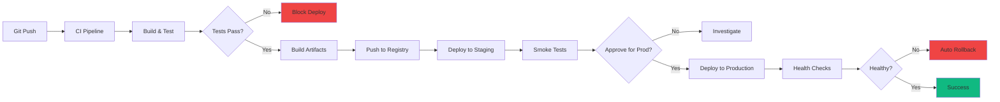
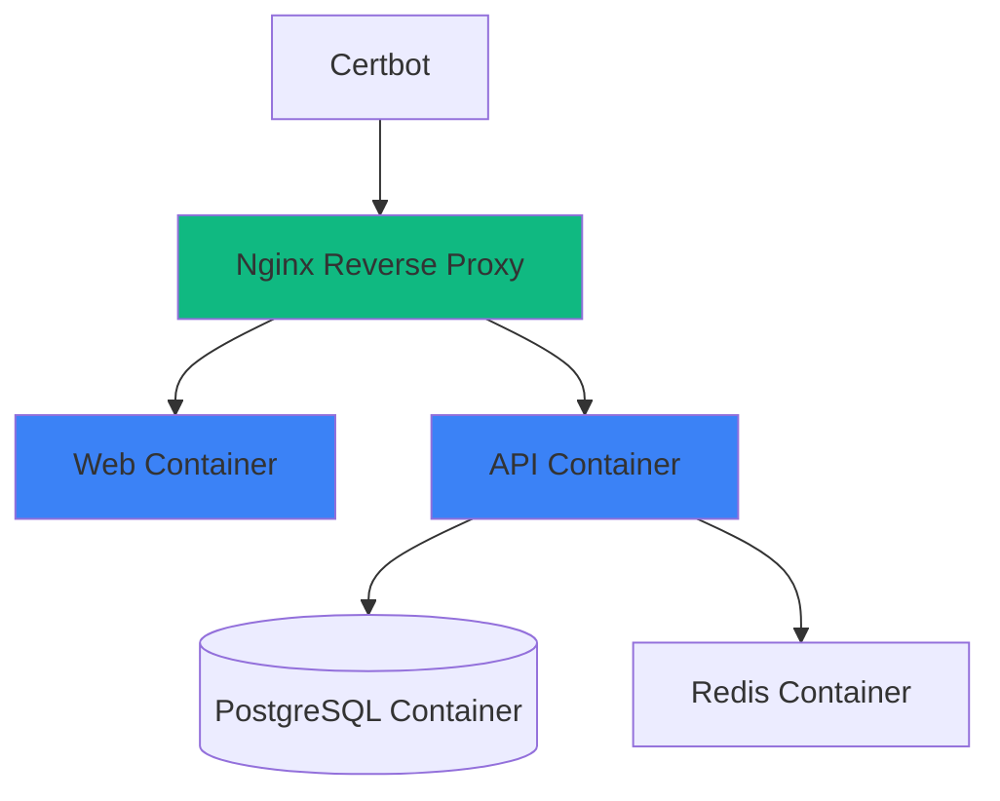
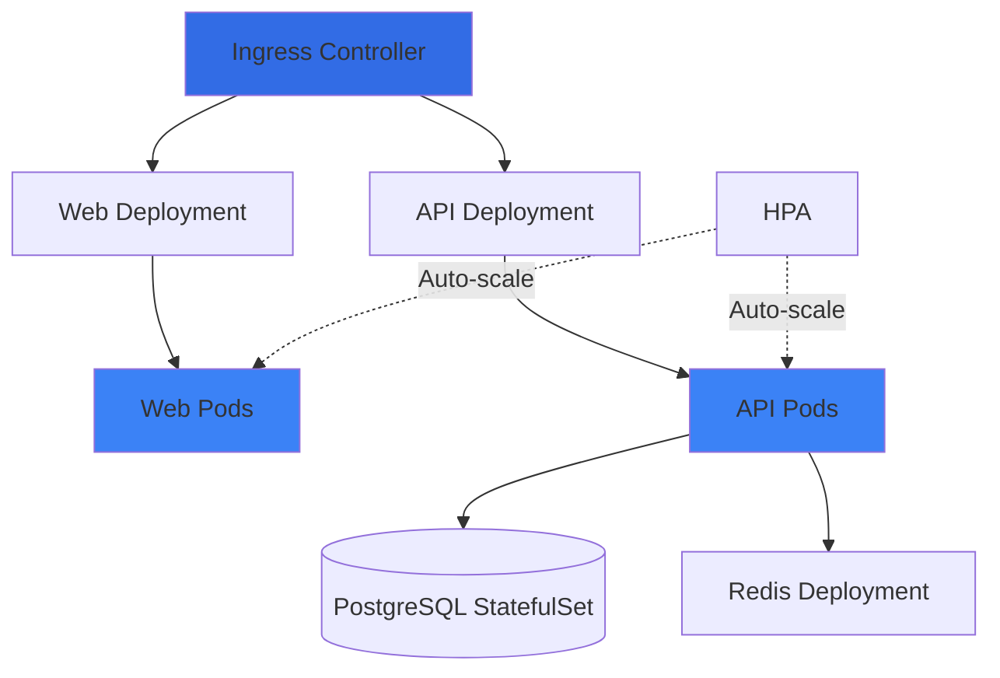
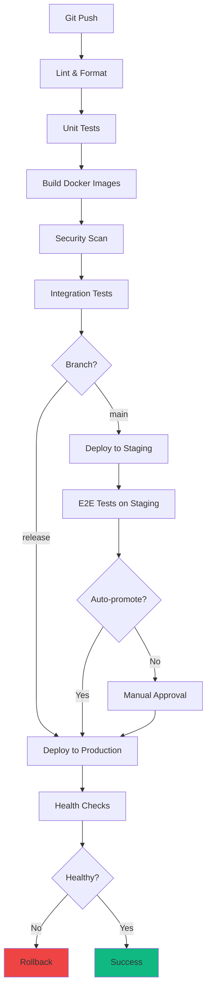
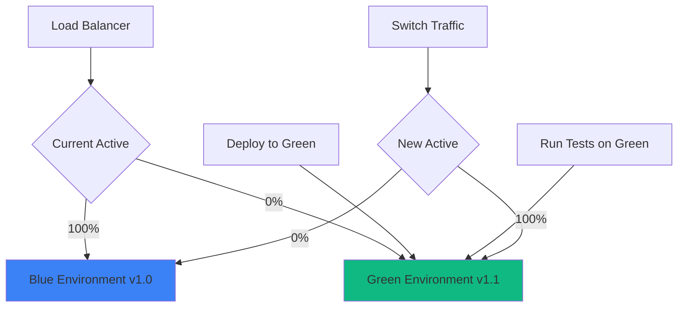

# Deployment Documentation

> Comprehensive deployment guide for enterprise fullstack applications

**Author:** Homero Thompson del Lago del Terror
**Last Updated:** 2026-01-19

---

## Table of Contents

- [Deployment Philosophy](#deployment-philosophy)
- [Deployment Targets](#deployment-targets)
- [Docker Compose](#docker-compose)
- [Kubernetes Deployment](#kubernetes-deployment)
- [CI/CD Pipelines](#cicd-pipelines)
- [GitOps with ArgoCD](#gitops-with-argocd)
- [Progressive Delivery](#progressive-delivery)
- [Monitoring & Observability](#monitoring--observability)
- [Rollback Strategies](#rollback-strategies)
- [Disaster Recovery](#disaster-recovery)

---

## Deployment Philosophy

### Key Principles

| Principle | Implementation |
|-----------|----------------|
| **Automation First** | Everything via CI/CD, no manual steps |
| **Immutable Infrastructure** | Never modify running instances |
| **Zero-Downtime Deploys** | Blue-green or rolling updates |
| **Rollback Ready** | Can rollback in <5 minutes |
| **Environment Parity** | Dev/staging/prod are identical |

### Deployment Flow



---

## Deployment Targets

### Comparison Matrix

| Target | Best For | Pros | Cons | Cost |
|--------|----------|------|------|------|
| **Vercel + AWS** | Startups, MVPs | Easy setup, fast | Vendor lock-in | $50-500/mo |
| **Docker Compose** | Development, small teams | Simple, portable | Single server | $20-100/mo VPS |
| **Kubernetes** | Scale-ups, enterprises | Auto-scaling, HA | Complex setup | $500-5k/mo |
| **Serverless** | Variable traffic | Pay-per-use | Cold starts | $100-1k/mo |

### Architecture by Target

#### Option 1: Vercel + AWS

```mermaid
graph TD
    A[Vercel Edge] --> B[Next.js App]
    B --> C[API Routes]
    C --> D[AWS Lambda]
    D --> E[(RDS PostgreSQL)]

    B --> F[S3 Static Assets]
    B --> G[CloudFront CDN]

    style A fill:#000000
    style D fill:#ff9900
    style E fill:#ff9900
```



#### Option 2: Docker Compose (Single Server)



#### Option 3: Kubernetes (Full Scale)



---

## Docker Compose

### Production Docker Compose

```yaml
# docker-compose.prod.yml
version: '3.9'

services:
  nginx:
    image: nginx:alpine
    ports:
      - "80:80"
      - "443:443"
    volumes:
      - ./nginx/nginx.conf:/etc/nginx/nginx.conf:ro
      - ./nginx/ssl:/etc/nginx/ssl:ro
      - certbot-webroot:/var/www/certbot:ro
    depends_on:
      - web
      - api
    restart: always

  web:
    image: ${REGISTRY}/web:${VERSION}
    environment:
      - NEXT_PUBLIC_API_URL=${API_URL}
      - NODE_ENV=production
    expose:
      - "3000"
    restart: always
    deploy:
      replicas: 2
      resources:
        limits:
          cpus: '1'
          memory: 1G

  api:
    image: ${REGISTRY}/api:${VERSION}
    environment:
      - DATABASE_URL=${DATABASE_URL}
      - REDIS_URL=redis://redis:6379
      - SECRET_KEY=${SECRET_KEY}
    expose:
      - "8000"
    depends_on:
      - postgres
      - redis
    restart: always
    deploy:
      replicas: 2
      resources:
        limits:
          cpus: '1'
          memory: 1G

  postgres:
    image: postgres:16-alpine
    environment:
      - POSTGRES_USER=${DB_USER}
      - POSTGRES_PASSWORD=${DB_PASSWORD}
      - POSTGRES_DB=${DB_NAME}
    volumes:
      - postgres-data:/var/lib/postgresql/data
      - ./backups:/backups
    restart: always
    deploy:
      resources:
        limits:
          cpus: '2'
          memory: 2G

  redis:
    image: redis:7-alpine
    command: redis-server --appendonly yes
    volumes:
      - redis-data:/data
    restart: always

  certbot:
    image: certbot/certbot
    volumes:
      - certbot-certs:/etc/letsencrypt
      - certbot-webroot:/var/www/certbot
    entrypoint: "/bin/sh -c 'trap exit TERM; while :; do certbot renew; sleep 12h & wait $${!}; done;'"

volumes:
  postgres-data:
  redis-data:
  certbot-certs:
  certbot-webroot:
```

### Deployment Script

```bash
#!/bin/bash
# deploy.sh - Deploy to Docker Compose

set -e

# Configuration
REGISTRY="ghcr.io/myorg"
VERSION="${1:-latest}"
ENV_FILE="${2:-.env.production}"

echo "🚀 Deploying version: $VERSION"

# Load environment variables
if [ -f "$ENV_FILE" ]; then
  export $(cat "$ENV_FILE" | grep -v '#' | xargs)
else
  echo "❌ Environment file not found: $ENV_FILE"
  exit 1
fi

# Pull latest images
echo "📦 Pulling images..."
docker compose -f docker-compose.prod.yml pull

# Run database migrations
echo "🗄️ Running migrations..."
docker compose -f docker-compose.prod.yml run --rm api python -m alembic upgrade head

# Deploy with zero downtime
echo "🔄 Deploying services..."
docker compose -f docker-compose.prod.yml up -d --no-deps --build

# Health check
echo "🏥 Running health checks..."
sleep 10

if curl -f http://localhost/health > /dev/null 2>&1; then
  echo "✅ Deployment successful!"
else
  echo "❌ Health check failed, rolling back..."
  docker compose -f docker-compose.prod.yml rollback
  exit 1
fi

# Cleanup old images
echo "🧹 Cleaning up..."
docker image prune -f

echo "🎉 Deployment complete!"
```

---

## Kubernetes Deployment

### Namespace Structure

```yaml
# k8s/namespaces.yaml
apiVersion: v1
kind: Namespace
metadata:
  name: production
  labels:
    environment: production
---
apiVersion: v1
kind: Namespace
metadata:
  name: staging
  labels:
    environment: staging
```

### Application Deployment

```yaml
# k8s/web-deployment.yaml
apiVersion: apps/v1
kind: Deployment
metadata:
  name: web
  namespace: production
spec:
  replicas: 3
  strategy:
    type: RollingUpdate
    rollingUpdate:
      maxSurge: 1
      maxUnavailable: 0
  selector:
    matchLabels:
      app: web
  template:
    metadata:
      labels:
        app: web
        version: v1.0.0
    spec:
      containers:
      - name: web
        image: ghcr.io/myorg/web:v1.0.0
        ports:
        - containerPort: 3000
        env:
        - name: NEXT_PUBLIC_API_URL
          valueFrom:
            configMapKeyRef:
              name: web-config
              key: api-url
        resources:
          requests:
            memory: "256Mi"
            cpu: "250m"
          limits:
            memory: "1Gi"
            cpu: "1000m"
        livenessProbe:
          httpGet:
            path: /api/health
            port: 3000
          initialDelaySeconds: 30
          periodSeconds: 10
        readinessProbe:
          httpGet:
            path: /api/health
            port: 3000
          initialDelaySeconds: 5
          periodSeconds: 5
---
apiVersion: v1
kind: Service
metadata:
  name: web
  namespace: production
spec:
  selector:
    app: web
  ports:
  - protocol: TCP
    port: 80
    targetPort: 3000
  type: ClusterIP
```

### Horizontal Pod Autoscaler

```yaml
# k8s/hpa.yaml
apiVersion: autoscaling/v2
kind: HorizontalPodAutoscaler
metadata:
  name: web-hpa
  namespace: production
spec:
  scaleTargetRef:
    apiVersion: apps/v1
    kind: Deployment
    name: web
  minReplicas: 3
  maxReplicas: 10
  metrics:
  - type: Resource
    resource:
      name: cpu
      target:
        type: Utilization
        averageUtilization: 70
  - type: Resource
    resource:
      name: memory
      target:
        type: Utilization
        averageUtilization: 80
  behavior:
    scaleDown:
      stabilizationWindowSeconds: 300
      policies:
      - type: Percent
        value: 50
        periodSeconds: 60
    scaleUp:
      stabilizationWindowSeconds: 0
      policies:
      - type: Percent
        value: 100
        periodSeconds: 15
      - type: Pods
        value: 4
        periodSeconds: 15
      selectPolicy: Max
```

### Ingress Configuration

```yaml
# k8s/ingress.yaml
apiVersion: networking.k8s.io/v1
kind: Ingress
metadata:
  name: main-ingress
  namespace: production
  annotations:
    cert-manager.io/cluster-issuer: letsencrypt-prod
    nginx.ingress.kubernetes.io/ssl-redirect: "true"
    nginx.ingress.kubernetes.io/rate-limit: "100"
spec:
  ingressClassName: nginx
  tls:
  - hosts:
    - example.com
    - www.example.com
    secretName: example-tls
  rules:
  - host: example.com
    http:
      paths:
      - path: /api
        pathType: Prefix
        backend:
          service:
            name: api
            port:
              number: 80
      - path: /
        pathType: Prefix
        backend:
          service:
            name: web
            port:
              number: 80
```

### StatefulSet for Database

```yaml
# k8s/postgres-statefulset.yaml
apiVersion: apps/v1
kind: StatefulSet
metadata:
  name: postgres
  namespace: production
spec:
  serviceName: postgres
  replicas: 1
  selector:
    matchLabels:
      app: postgres
  template:
    metadata:
      labels:
        app: postgres
    spec:
      containers:
      - name: postgres
        image: postgres:16
        ports:
        - containerPort: 5432
        env:
        - name: POSTGRES_PASSWORD
          valueFrom:
            secretKeyRef:
              name: postgres-secret
              key: password
        - name: PGDATA
          value: /var/lib/postgresql/data/pgdata
        volumeMounts:
        - name: postgres-storage
          mountPath: /var/lib/postgresql/data
        resources:
          requests:
            memory: "1Gi"
            cpu: "500m"
          limits:
            memory: "2Gi"
            cpu: "2000m"
  volumeClaimTemplates:
  - metadata:
      name: postgres-storage
    spec:
      accessModes: [ "ReadWriteOnce" ]
      resources:
        requests:
          storage: 50Gi
      storageClassName: fast-ssd
```

---

## CI/CD Pipelines

### Multi-Stage Pipeline



### GitHub Actions Pipeline

```yaml
# .github/workflows/deploy.yml
name: Deploy Pipeline

on:
  push:
    branches: [main, release/*]
  pull_request:
    branches: [main]

env:
  REGISTRY: ghcr.io
  IMAGE_NAME: ${{ github.repository }}

jobs:
  lint:
    runs-on: ubuntu-latest
    steps:
      - uses: actions/checkout@v4

      - name: Setup Node
        uses: actions/setup-node@v4
        with:
          node-version: '20'

      - name: Install dependencies
        run: npm ci

      - name: Lint
        run: npm run lint

      - name: Format check
        run: npm run format:check

  test:
    runs-on: ubuntu-latest
    needs: lint
    steps:
      - uses: actions/checkout@v4

      - name: Run tests
        run: npm run test:coverage

      - name: Upload coverage
        uses: codecov/codecov-action@v3

  build:
    runs-on: ubuntu-latest
    needs: test
    permissions:
      contents: read
      packages: write
    outputs:
      version: ${{ steps.meta.outputs.version }}
    steps:
      - uses: actions/checkout@v4

      - name: Set up Docker Buildx
        uses: docker/setup-buildx-action@v3

      - name: Login to GitHub Container Registry
        uses: docker/login-action@v3
        with:
          registry: ${{ env.REGISTRY }}
          username: ${{ github.actor }}
          password: ${{ secrets.GITHUB_TOKEN }}

      - name: Extract metadata
        id: meta
        uses: docker/metadata-action@v5
        with:
          images: ${{ env.REGISTRY }}/${{ env.IMAGE_NAME }}
          tags: |
            type=ref,event=branch
            type=ref,event=pr
            type=semver,pattern={{version}}
            type=sha,prefix={{branch}}-

      - name: Build and push
        uses: docker/build-push-action@v5
        with:
          context: .
          push: true
          tags: ${{ steps.meta.outputs.tags }}
          cache-from: type=gha
          cache-to: type=gha,mode=max

  security-scan:
    runs-on: ubuntu-latest
    needs: build
    steps:
      - name: Run Trivy scan
        uses: aquasecurity/trivy-action@master
        with:
          image-ref: ${{ env.REGISTRY }}/${{ env.IMAGE_NAME }}:${{ github.sha }}
          severity: 'CRITICAL,HIGH'
          exit-code: '1'

  deploy-staging:
    runs-on: ubuntu-latest
    needs: [build, security-scan]
    if: github.ref == 'refs/heads/main'
    environment:
      name: staging
      url: https://staging.example.com
    steps:
      - name: Deploy to staging
        uses: appleboy/ssh-action@master
        with:
          host: ${{ secrets.STAGING_HOST }}
          username: ${{ secrets.STAGING_USER }}
          key: ${{ secrets.STAGING_SSH_KEY }}
          script: |
            cd /opt/app
            export VERSION=${{ github.sha }}
            docker compose -f docker-compose.prod.yml pull
            docker compose -f docker-compose.prod.yml up -d

      - name: Health check
        run: |
          sleep 10
          curl -f https://staging.example.com/health || exit 1

  e2e-tests:
    runs-on: ubuntu-latest
    needs: deploy-staging
    steps:
      - uses: actions/checkout@v4

      - name: Install Playwright
        run: npx playwright install --with-deps

      - name: Run E2E tests
        env:
          E2E_BASE_URL: https://staging.example.com
        run: npm run test:e2e

  deploy-production:
    runs-on: ubuntu-latest
    needs: e2e-tests
    if: startsWith(github.ref, 'refs/heads/release/')
    environment:
      name: production
      url: https://example.com
    steps:
      - name: Deploy to production
        uses: appleboy/ssh-action@master
        with:
          host: ${{ secrets.PROD_HOST }}
          username: ${{ secrets.PROD_USER }}
          key: ${{ secrets.PROD_SSH_KEY }}
          script: |
            cd /opt/app
            export VERSION=${{ github.sha }}
            ./deploy.sh $VERSION

      - name: Notify Slack
        uses: slackapi/slack-github-action@v1
        with:
          payload: |
            {
              "text": "🚀 Deployed ${{ github.sha }} to production"
            }
        env:
          SLACK_WEBHOOK_URL: ${{ secrets.SLACK_WEBHOOK }}
```

---

## GitOps with ArgoCD

### ArgoCD Application

```yaml
# argocd/application.yaml
apiVersion: argoproj.io/v1alpha1
kind: Application
metadata:
  name: myapp-production
  namespace: argocd
spec:
  project: default
  source:
    repoURL: https://github.com/myorg/myapp
    targetRevision: main
    path: k8s/overlays/production
  destination:
    server: https://kubernetes.default.svc
    namespace: production
  syncPolicy:
    automated:
      prune: true
      selfHeal: true
      allowEmpty: false
    syncOptions:
    - CreateNamespace=true
    retry:
      limit: 5
      backoff:
        duration: 5s
        factor: 2
        maxDuration: 3m
```

### Kustomize Structure

```
k8s/
├── base/
│   ├── deployment.yaml
│   ├── service.yaml
│   └── kustomization.yaml
└── overlays/
    ├── staging/
    │   ├── kustomization.yaml
    │   └── patches/
    └── production/
        ├── kustomization.yaml
        └── patches/
```

```yaml
# k8s/overlays/production/kustomization.yaml
apiVersion: kustomize.config.k8s.io/v1beta1
kind: Kustomization

bases:
- ../../base

namespace: production

replicas:
- name: web
  count: 5
- name: api
  count: 3

images:
- name: web
  newName: ghcr.io/myorg/web
  newTag: v1.0.0

patches:
- path: patches/increase-resources.yaml
```

---

## Progressive Delivery

### Blue-Green Deployment



### Canary Deployment

```yaml
# k8s/canary/rollout.yaml
apiVersion: argoproj.io/v1alpha1
kind: Rollout
metadata:
  name: web
spec:
  replicas: 5
  strategy:
    canary:
      steps:
      - setWeight: 20
      - pause: {duration: 5m}
      - setWeight: 40
      - pause: {duration: 5m}
      - setWeight: 60
      - pause: {duration: 5m}
      - setWeight: 80
      - pause: {duration: 5m}
      canaryService: web-canary
      stableService: web-stable
      trafficRouting:
        nginx:
          stableIngress: web-ingress
  revisionHistoryLimit: 3
  selector:
    matchLabels:
      app: web
  template:
    metadata:
      labels:
        app: web
    spec:
      containers:
      - name: web
        image: ghcr.io/myorg/web:v1.1.0
```

### Feature Flags

```typescript
// lib/feature-flags.ts
import { PostHog } from 'posthog-node';

const posthog = new PostHog(process.env.POSTHOG_API_KEY!);

export async function isFeatureEnabled(
  flag: string,
  userId: string
): Promise<boolean> {
  return await posthog.isFeatureEnabled(flag, userId);
}

// Usage in API
if (await isFeatureEnabled('new-checkout', user.id)) {
  return newCheckoutFlow();
} else {
  return legacyCheckoutFlow();
}
```

---

## Monitoring & Observability

### Monitoring Stack

```yaml
# monitoring/prometheus-stack.yaml
apiVersion: v1
kind: ConfigMap
metadata:
  name: prometheus-config
data:
  prometheus.yml: |
    global:
      scrape_interval: 15s

    scrape_configs:
    - job_name: 'kubernetes-pods'
      kubernetes_sd_configs:
      - role: pod
      relabel_configs:
      - source_labels: [__meta_kubernetes_pod_annotation_prometheus_io_scrape]
        action: keep
        regex: true
```

### Application Metrics

```python
# apps/api/src/metrics.py
from prometheus_client import Counter, Histogram, Gauge

# Request counter
request_count = Counter(
    'http_requests_total',
    'Total HTTP requests',
    ['method', 'endpoint', 'status']
)

# Response time histogram
request_duration = Histogram(
    'http_request_duration_seconds',
    'HTTP request duration',
    ['method', 'endpoint']
)

# Active users gauge
active_users = Gauge(
    'active_users',
    'Number of active users'
)
```

### Grafana Dashboard

```json
{
  "dashboard": {
    "title": "Application Metrics",
    "panels": [
      {
        "title": "Request Rate",
        "targets": [
          {
            "expr": "rate(http_requests_total[5m])"
          }
        ]
      },
      {
        "title": "Error Rate",
        "targets": [
          {
            "expr": "rate(http_requests_total{status=~\"5..\"}[5m])"
          }
        ]
      },
      {
        "title": "Response Time p95",
        "targets": [
          {
            "expr": "histogram_quantile(0.95, rate(http_request_duration_seconds_bucket[5m]))"
          }
        ]
      }
    ]
  }
}
```

---

## Rollback Strategies

### Automated Rollback

```yaml
# k8s/rollout-with-analysis.yaml
apiVersion: argoproj.io/v1alpha1
kind: Rollout
metadata:
  name: web
spec:
  strategy:
    canary:
      analysis:
        templates:
        - templateName: error-rate
        startingStep: 2
        args:
        - name: service-name
          value: web
---
apiVersion: argoproj.io/v1alpha1
kind: AnalysisTemplate
metadata:
  name: error-rate
spec:
  args:
  - name: service-name
  metrics:
  - name: error-rate
    interval: 1m
    successCondition: result < 0.05
    failureLimit: 3
    provider:
      prometheus:
        address: http://prometheus:9090
        query: |
          rate(http_requests_total{service="{{args.service-name}}",status=~"5.."}[5m])
          /
          rate(http_requests_total{service="{{args.service-name}}"}[5m])
```

### Manual Rollback

```bash
# Kubernetes rollback
kubectl rollout undo deployment/web -n production

# Docker Compose rollback
docker compose -f docker-compose.prod.yml down
export VERSION=previous-stable-version
docker compose -f docker-compose.prod.yml up -d

# Verify rollback
curl https://example.com/health
```

---

## Disaster Recovery

### Backup Strategy

```bash
#!/bin/bash
# backup.sh - Automated database backup

set -e

BACKUP_DIR="/backups"
DATE=$(date +%Y%m%d_%H%M%S)
S3_BUCKET="s3://myapp-backups"

# Database backup
pg_dump -h postgres -U $DB_USER $DB_NAME | gzip > "$BACKUP_DIR/db_$DATE.sql.gz"

# Upload to S3
aws s3 cp "$BACKUP_DIR/db_$DATE.sql.gz" "$S3_BUCKET/db_$DATE.sql.gz"

# Keep only last 30 days locally
find "$BACKUP_DIR" -name "db_*.sql.gz" -mtime +30 -delete

echo "✅ Backup completed: db_$DATE.sql.gz"
```

### Recovery Procedure

```bash
#!/bin/bash
# restore.sh - Restore from backup

set -e

BACKUP_FILE="$1"

if [ -z "$BACKUP_FILE" ]; then
  echo "Usage: $0 <backup_file>"
  exit 1
fi

# Download from S3
aws s3 cp "s3://myapp-backups/$BACKUP_FILE" /tmp/restore.sql.gz

# Stop application
docker compose -f docker-compose.prod.yml stop api

# Restore database
gunzip -c /tmp/restore.sql.gz | psql -h postgres -U $DB_USER $DB_NAME

# Start application
docker compose -f docker-compose.prod.yml start api

echo "✅ Restore completed"
```

---

## Deployment Checklist

### Pre-Deployment

- [ ] All tests passing
- [ ] Security scans passed
- [ ] Database migrations tested
- [ ] Feature flags configured
- [ ] Monitoring alerts configured
- [ ] Rollback plan documented
- [ ] Stakeholders notified

### During Deployment

- [ ] Deploy to staging first
- [ ] Run smoke tests
- [ ] Monitor error rates
- [ ] Check performance metrics
- [ ] Verify database connections
- [ ] Test critical user flows

### Post-Deployment

- [ ] Verify health checks
- [ ] Check application logs
- [ ] Monitor error tracking (Sentry)
- [ ] Verify metrics in Grafana
- [ ] Test rollback procedure
- [ ] Update documentation
- [ ] Notify team of completion

---

## Cross-References

| Topic | Document |
|-------|----------|
| Architecture overview | [ARCHITECTURE.md](./ARCHITECTURE.md) |
| Security in production | [SECURITY.md](./SECURITY.md) |
| Testing before deploy | [TESTING.md](./TESTING.md) |

---

**Version:** 2.0
**Last Updated:** 2026-01-19
