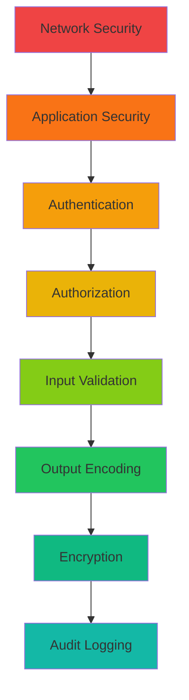
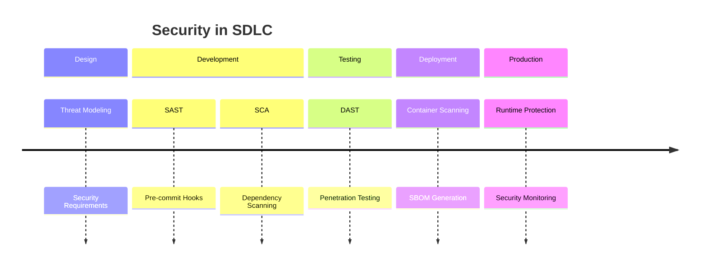
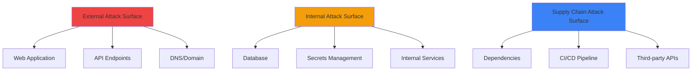
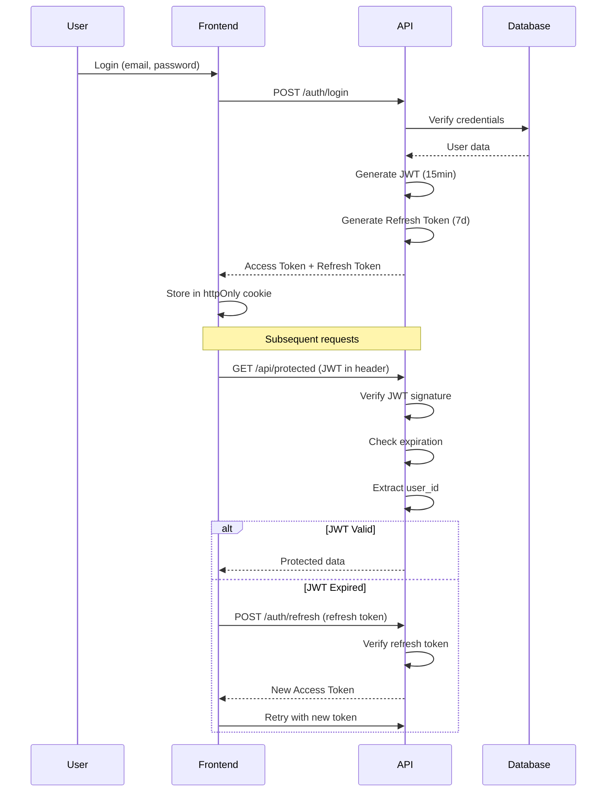
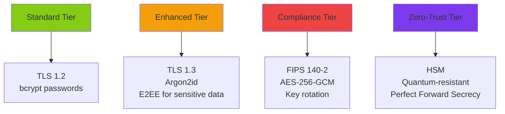
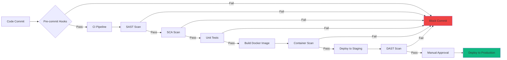
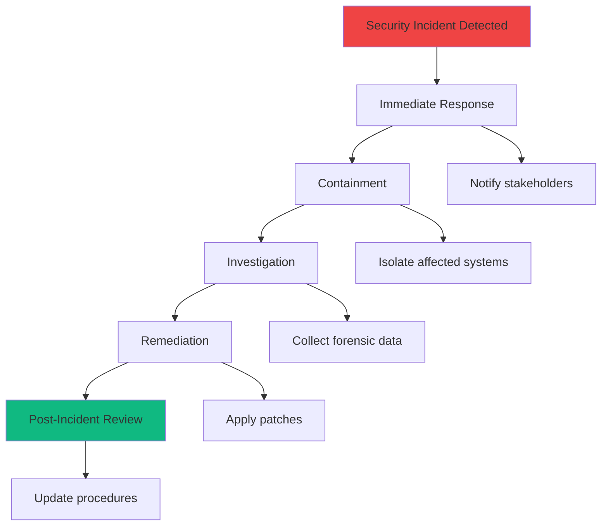

# Security Documentation

> Comprehensive security guide for enterprise fullstack applications

**Author:** Homero Thompson del Lago del Terror
**Last Updated:** 2026-01-19

---

## Table of Contents

- [Security Philosophy](#security-philosophy)
- [Security Tiers](#security-tiers)
- [Threat Model](#threat-model)
- [Authentication & Authorization](#authentication--authorization)
- [Encryption](#encryption)
- [Static Analysis (SAST)](#static-analysis-sast)
- [Software Composition Analysis (SCA)](#software-composition-analysis-sca)
- [Dynamic Analysis (DAST)](#dynamic-analysis-dast)
- [Container Security](#container-security)
- [Runtime Protection](#runtime-protection)
- [Security Gates](#security-gates)
- [Incident Response](#incident-response)

---

## Security Philosophy

### Defense in Depth

Security is implemented in **multiple layers**, ensuring that if one layer is compromised, others provide protection:



### Shift Left Security

Security is integrated **early in the development lifecycle**, not as an afterthought:



---

## Security Tiers

The scaffold supports **4 security tiers** based on project requirements:

### Tier Comparison

| Feature | Standard | Enhanced | Compliance | Zero-Trust |
|---------|----------|----------|------------|------------|
| **SAST** | ESLint Security | Semgrep Pro | Checkmarx/Fortify | All + CodeQL |
| **SCA** | npm audit | Snyk | Snyk + SBOM | FOSSA + Binary Analysis |
| **DAST** | Manual | OWASP ZAP | Burp Suite Pro | Burp + HackerOne |
| **Secrets** | Pre-commit | Gitleaks CI/CD | Vault + Rotation | HSM + Secrets Manager |
| **Authentication** | JWT | JWT + MFA | SAML/OIDC | mTLS + Hardware Keys |
| **Encryption** | TLS 1.2 | TLS 1.3 + E2EE | FIPS 140-2 | HSM + Quantum-resistant |
| **Compliance** | None | GDPR basics | SOC2/ISO27001 | FedRAMP/HIPAA |
| **Cost** | Free | $50-500/mo | $2k-10k/mo | $20k+/mo |

---

## Threat Model

### STRIDE Framework

| Threat | Mitigation |
|--------|------------|
| **Spoofing** | Strong authentication (JWT + MFA) |
| **Tampering** | Input validation, integrity checks |
| **Repudiation** | Audit logging, non-repudiation |
| **Information Disclosure** | Encryption at rest/transit, access control |
| **Denial of Service** | Rate limiting, CAPTCHA, WAF |
| **Elevation of Privilege** | RBAC, least privilege principle |

### Attack Surface



---

## Authentication & Authorization

### JWT Authentication Flow



### Role-Based Access Control (RBAC)

```python
# apps/api/src/auth/rbac.py
from enum import Enum
from typing import List

class Role(str, Enum):
    ADMIN = "admin"
    USER = "user"
    GUEST = "guest"

class Permission(str, Enum):
    READ_USERS = "users:read"
    WRITE_USERS = "users:write"
    DELETE_USERS = "users:delete"
    READ_POSTS = "posts:read"
    WRITE_POSTS = "posts:write"

ROLE_PERMISSIONS: dict[Role, List[Permission]] = {
    Role.ADMIN: list(Permission),  # All permissions
    Role.USER: [
        Permission.READ_USERS,
        Permission.READ_POSTS,
        Permission.WRITE_POSTS,
    ],
    Role.GUEST: [
        Permission.READ_POSTS,
    ],
}

def check_permission(user_role: Role, permission: Permission) -> bool:
    """Check if role has permission."""
    return permission in ROLE_PERMISSIONS.get(user_role, [])
```

### OAuth2 / OIDC Integration

```typescript
// apps/web/lib/auth/providers.ts
export const authProviders = {
  google: {
    clientId: process.env.GOOGLE_CLIENT_ID!,
    clientSecret: process.env.GOOGLE_CLIENT_SECRET!,
    authorizationUrl: 'https://accounts.google.com/o/oauth2/v2/auth',
    tokenUrl: 'https://oauth2.googleapis.com/token',
    scopes: ['openid', 'email', 'profile'],
  },
  github: {
    clientId: process.env.GITHUB_CLIENT_ID!,
    clientSecret: process.env.GITHUB_CLIENT_SECRET!,
    authorizationUrl: 'https://github.com/login/oauth/authorize',
    tokenUrl: 'https://github.com/login/oauth/access_token',
    scopes: ['read:user', 'user:email'],
  },
};
```

---

## Encryption

### Encryption Levels by Tier



### Data at Rest

```python
# packages/database/encryption.py
from cryptography.fernet import Fernet
from cryptography.hazmat.primitives.kdf.pbkdf2 import PBKDF2
from cryptography.hazmat.backends import default_backend
from cryptography.hazmat.primitives import hashes
import base64
import os

def derive_key(password: str, salt: bytes) -> bytes:
    """Derive encryption key from password."""
    kdf = PBKDF2(
        algorithm=hashes.SHA256(),
        length=32,
        salt=salt,
        iterations=100000,
        backend=default_backend()
    )
    return base64.urlsafe_b64encode(kdf.derive(password.encode()))

def encrypt_field(plaintext: str, key: bytes) -> str:
    """Encrypt sensitive field."""
    f = Fernet(key)
    return f.encrypt(plaintext.encode()).decode()

def decrypt_field(ciphertext: str, key: bytes) -> str:
    """Decrypt sensitive field."""
    f = Fernet(key)
    return f.decrypt(ciphertext.encode()).decode()
```

### Data in Transit

```nginx
# infrastructure/nginx/ssl.conf
server {
    listen 443 ssl http2;
    server_name example.com;

    # TLS 1.3 only (Enhanced tier+)
    ssl_protocols TLSv1.3;

    # Strong cipher suites
    ssl_ciphers 'TLS_AES_256_GCM_SHA384:TLS_CHACHA20_POLY1305_SHA256';
    ssl_prefer_server_ciphers off;

    # HSTS (2 years)
    add_header Strict-Transport-Security "max-age=63072000; includeSubDomains; preload" always;

    # Certificate
    ssl_certificate /etc/letsencrypt/live/example.com/fullchain.pem;
    ssl_certificate_key /etc/letsencrypt/live/example.com/privkey.pem;

    # OCSP stapling
    ssl_stapling on;
    ssl_stapling_verify on;
}
```

---

## Static Analysis (SAST)

### Tool Matrix

| Tier | Tool | Language | Features |
|------|------|----------|----------|
| **Standard** | ESLint + Security plugins | JS/TS | Basic rules |
| | Bandit | Python | Security linting |
| **Enhanced** | Semgrep | Multi | Custom rules, CI/CD |
| | Ruff | Python | Fast linting |
| **Compliance** | Checkmarx | Multi | Enterprise SAST |
| | Fortify | Multi | OWASP compliance |
| **Zero-Trust** | CodeQL | Multi | GitHub Advanced Security |

### Semgrep Configuration

```yaml
# .semgrep.yml
rules:
  - id: hardcoded-secret
    pattern: |
      $SECRET = "..."
    message: Hardcoded secret detected
    severity: ERROR
    languages: [python, javascript, typescript]

  - id: sql-injection
    pattern: |
      execute($QUERY)
    message: Possible SQL injection
    severity: ERROR
    languages: [python]

  - id: xss-vulnerability
    pattern: |
      dangerouslySetInnerHTML={{ __html: $INPUT }}
    message: XSS vulnerability via dangerouslySetInnerHTML
    severity: WARNING
    languages: [javascript, typescript]
```

### Pre-commit Hooks

```yaml
# .pre-commit-config.yaml
repos:
  # Secrets detection
  - repo: https://github.com/gitleaks/gitleaks
    rev: v8.18.1
    hooks:
      - id: gitleaks

  # SAST
  - repo: https://github.com/semgrep/semgrep
    rev: v1.45.0
    hooks:
      - id: semgrep
        args: ['--config', 'auto']

  # Python security
  - repo: https://github.com/PyCQA/bandit
    rev: 1.7.5
    hooks:
      - id: bandit
        args: ['-r', 'src/', '-ll']

  # TypeScript/JavaScript security
  - repo: local
    hooks:
      - id: eslint-security
        name: ESLint Security
        entry: npx eslint --plugin security
        language: node
        types: [javascript, typescript]
```

---

## Software Composition Analysis (SCA)

### Dependency Scanning

```yaml
# .github/workflows/sca.yml
name: SCA - Dependency Scanning

on: [push, pull_request]

jobs:
  npm-audit:
    runs-on: ubuntu-latest
    steps:
      - uses: actions/checkout@v4

      - name: Run npm audit
        run: npm audit --audit-level=moderate

  snyk:
    runs-on: ubuntu-latest
    steps:
      - uses: actions/checkout@v4

      - name: Run Snyk
        uses: snyk/actions/node@master
        env:
          SNYK_TOKEN: ${{ secrets.SNYK_TOKEN }}
        with:
          args: --severity-threshold=high

  python-safety:
    runs-on: ubuntu-latest
    steps:
      - uses: actions/checkout@v4

      - name: Run Safety
        run: |
          pip install safety
          safety check --json
```

### SBOM Generation

```bash
# Generate SBOM (Software Bill of Materials)
syft packages dir:. -o cyclonedx-json > sbom.json

# Scan SBOM for vulnerabilities
grype sbom:sbom.json --fail-on high
```

### License Compliance

```yaml
# .github/workflows/license-check.yml
name: License Compliance

on: [pull_request]

jobs:
  check-licenses:
    runs-on: ubuntu-latest
    steps:
      - uses: actions/checkout@v4

      - name: Check licenses
        uses: fossas/fossa-action@v1
        with:
          api-key: ${{ secrets.FOSSA_API_KEY }}
```

---

## Dynamic Analysis (DAST)

### OWASP ZAP Integration

```yaml
# .github/workflows/dast.yml
name: DAST - Security Testing

on:
  schedule:
    - cron: '0 2 * * 1'  # Weekly on Monday 2 AM

jobs:
  zap-scan:
    runs-on: ubuntu-latest
    steps:
      - name: ZAP Baseline Scan
        uses: zaproxy/action-baseline@v0.9.0
        with:
          target: 'https://staging.example.com'
          rules_file_name: '.zap/rules.tsv'
          cmd_options: '-a'
```

### Penetration Testing Checklist

| Test | Tool | Frequency |
|------|------|-----------|
| **Vulnerability Scanning** | Nessus/OpenVAS | Weekly |
| **Web App Scanning** | OWASP ZAP | Daily |
| **API Security Testing** | Postman/Burp | Per release |
| **Manual Pen Testing** | External firm | Quarterly |
| **Bug Bounty** | HackerOne | Continuous |

---

## Container Security

### Secure Dockerfile

```dockerfile
# Use minimal base image
FROM python:3.12-slim AS base

# Scan base image
RUN apt-get update && apt-get install -y --no-install-recommends \
    curl \
    && apt-get clean \
    && rm -rf /var/lib/apt/lists/*

# Non-root user
RUN useradd --create-home --uid 1000 appuser

# Set working directory
WORKDIR /app

# Copy dependencies first (layer caching)
COPY --chown=appuser:appuser requirements.txt .
RUN pip install --no-cache-dir -r requirements.txt

# Copy application
COPY --chown=appuser:appuser src/ ./src/

# Switch to non-root
USER appuser

# Health check
HEALTHCHECK --interval=30s --timeout=3s --retries=3 \
    CMD curl -f http://localhost:8000/health || exit 1

# Run application
CMD ["uvicorn", "src.main:app", "--host", "0.0.0.0", "--port", "8000"]
```

### Container Scanning

```yaml
# .github/workflows/container-scan.yml
name: Container Security Scan

on:
  push:
    branches: [main]

jobs:
  trivy:
    runs-on: ubuntu-latest
    steps:
      - uses: actions/checkout@v4

      - name: Build image
        run: docker build -t myapp:${{ github.sha }} .

      - name: Run Trivy
        uses: aquasecurity/trivy-action@master
        with:
          image-ref: myapp:${{ github.sha }}
          severity: 'CRITICAL,HIGH'
          exit-code: '1'

  grype:
    runs-on: ubuntu-latest
    steps:
      - name: Scan with Grype
        uses: anchore/scan-action@v3
        with:
          image: myapp:${{ github.sha }}
          fail-build: true
          severity-cutoff: high
```

---

## Runtime Protection

### Web Application Firewall (WAF)

```hcl
# infrastructure/terraform/waf.tf
resource "aws_wafv2_web_acl" "main" {
  name  = "production-waf"
  scope = "REGIONAL"

  default_action {
    allow {}
  }

  # Rate limiting
  rule {
    name     = "RateLimitRule"
    priority = 1

    statement {
      rate_based_statement {
        limit              = 2000
        aggregate_key_type = "IP"
      }
    }

    action {
      block {}
    }
  }

  # SQL injection protection
  rule {
    name     = "SQLiProtection"
    priority = 2

    statement {
      managed_rule_group_statement {
        vendor_name = "AWS"
        name        = "AWSManagedRulesSQLiRuleSet"
      }
    }

    override_action {
      none {}
    }
  }

  # XSS protection
  rule {
    name     = "XSSProtection"
    priority = 3

    statement {
      managed_rule_group_statement {
        vendor_name = "AWS"
        name        = "AWSManagedRulesKnownBadInputsRuleSet"
      }
    }

    override_action {
      none {}
    }
  }
}
```

### Runtime Application Self-Protection (RASP)

```typescript
// apps/api/src/middleware/rasp.ts
import { Request, Response, NextFunction } from 'express';
import { RateLimiterMemory } from 'rate-limiter-flexible';

const rateLimiter = new RateLimiterMemory({
  points: 100, // 100 requests
  duration: 60, // per 60 seconds
});

export async function raspMiddleware(
  req: Request,
  res: Response,
  next: NextFunction
) {
  try {
    // Rate limiting
    await rateLimiter.consume(req.ip);

    // SQL injection detection
    if (detectSQLi(req.body)) {
      return res.status(403).json({ error: 'SQL injection detected' });
    }

    // XSS detection
    if (detectXSS(req.body)) {
      return res.status(403).json({ error: 'XSS detected' });
    }

    next();
  } catch {
    res.status(429).json({ error: 'Too many requests' });
  }
}

function detectSQLi(input: any): boolean {
  const sqlPattern = /(\bunion\b|\bselect\b|\binsert\b|\bupdate\b|\bdelete\b|\bdrop\b)/i;
  return JSON.stringify(input).match(sqlPattern) !== null;
}

function detectXSS(input: any): boolean {
  const xssPattern = /<script|javascript:|onerror=/i;
  return JSON.stringify(input).match(xssPattern) !== null;
}
```

---

## Security Gates

### CI/CD Security Pipeline



### Security Gate Thresholds

| Gate | Standard | Enhanced | Compliance | Zero-Trust |
|------|----------|----------|------------|------------|
| **SAST** | High severity | Medium+ | Low+ | All issues |
| **SCA** | Critical vulns | High+ | Medium+ | All vulns |
| **Container** | Critical only | High+ | Medium+ | Low+ |
| **DAST** | Not required | High+ | Medium+ | All findings |
| **Code Coverage** | 70% | 80% | 90% | 95% |
| **Manual Review** | None | Staging | All deploys | All changes |

---

## Incident Response

### Incident Response Plan



### Security Contacts

```yaml
# SECURITY.md
security:
  contacts:
    - email: security@example.com
      response_time: 24h
      pgp_key: https://example.com/pgp.asc

  disclosure:
    policy: https://example.com/security/disclosure
    hall_of_fame: https://example.com/security/hall-of-fame

  bug_bounty:
    platform: hackerone
    url: https://hackerone.com/example
    scope:
      - "*.example.com"
      - "api.example.com"
```

---

## Security Checklist

### Pre-Production

- [ ] All secrets in environment variables (not hardcoded)
- [ ] HTTPS enforced with HSTS
- [ ] CORS configured properly
- [ ] Rate limiting enabled
- [ ] Input validation on all endpoints
- [ ] SQL injection protection (parameterized queries)
- [ ] XSS protection (output encoding)
- [ ] CSRF protection enabled
- [ ] Authentication implemented
- [ ] Authorization (RBAC) implemented
- [ ] Audit logging enabled
- [ ] Error messages don't leak sensitive info
- [ ] Dependencies scanned for vulnerabilities
- [ ] Container images scanned
- [ ] Security headers configured
- [ ] Database access restricted
- [ ] Backups encrypted
- [ ] Monitoring and alerting configured

### Compliance (SOC2/ISO27001)

- [ ] Access control policies documented
- [ ] Incident response plan documented
- [ ] Disaster recovery plan documented
- [ ] Employee security training completed
- [ ] Third-party vendor assessments
- [ ] Penetration testing completed
- [ ] Vulnerability management process
- [ ] Change management process
- [ ] Data classification policy
- [ ] Encryption at rest and in transit

---

## Security Tools Summary

| Category | Free/Open Source | Commercial |
|----------|------------------|------------|
| **SAST** | Semgrep, Bandit, ESLint | Checkmarx, Fortify, CodeQL |
| **SCA** | npm audit, Safety | Snyk, FOSSA, WhiteSource |
| **DAST** | OWASP ZAP, Nikto | Burp Suite Pro, Acunetix |
| **Container** | Trivy, Grype | Aqua, Twistlock, Snyk Container |
| **Secrets** | Gitleaks, TruffleHog | GitGuardian, Doppler |
| **WAF** | ModSecurity | AWS WAF, Cloudflare, Imperva |
| **Monitoring** | Falco, OSSEC | Datadog Security, Splunk |

---

## Cross-References

| Topic | Document |
|-------|----------|
| Architecture patterns | [ARCHITECTURE.md](./ARCHITECTURE.md) |
| Testing strategies | [TESTING.md](./TESTING.md) |
| Deployment security | [DEPLOYMENT.md](./DEPLOYMENT.md) |

---

**Version:** 2.0
**Last Updated:** 2026-01-19
