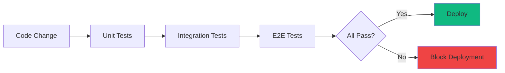
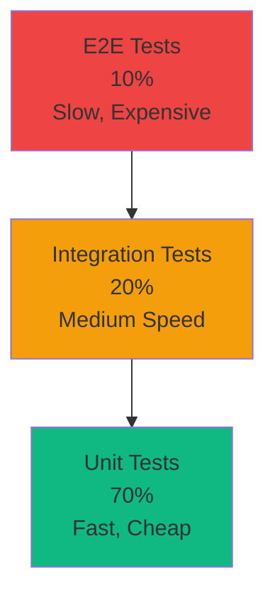

# Testing Strategy Documentation

> Comprehensive testing guide for enterprise fullstack applications

**Author:** Homero Thompson del Lago del Terror
**Last Updated:** 2026-01-19

---

## Table of Contents

- [Testing Philosophy](#testing-philosophy)
- [Testing Pyramid](#testing-pyramid)
- [Unit Testing](#unit-testing)
- [Integration Testing](#integration-testing)
- [E2E Testing](#e2e-testing)
- [Contract Testing](#contract-testing)
- [Load Testing](#load-testing)
- [Chaos Engineering](#chaos-engineering)
- [Coverage Requirements](#coverage-requirements)
- [CI/CD Integration](#cicd-integration)

---

## Testing Philosophy

### Quality Gates

Testing is not optional—it's a **requirement** for production deployments:



### Shift-Left Testing

Tests are written **during development**, not after:

| When | Test Type | Purpose |
|------|-----------|---------|
| **While coding** | Unit tests | Verify logic works |
| **Before PR** | Integration tests | Verify components work together |
| **Before merge** | E2E tests | Verify user flows work |
| **Before deploy** | Load tests | Verify system handles traffic |
| **After deploy** | Smoke tests | Verify deployment succeeded |

---

## Testing Pyramid

### The Pyramid Model



### Test Distribution by Scale

| Scale | Unit | Integration | E2E | Load | Chaos |
|-------|------|-------------|-----|------|-------|
| **Startup** | 70% | 20% | 10% | Manual | No |
| **Scale-up** | 65% | 25% | 10% | Weekly | No |
| **Enterprise** | 60% | 25% | 10% | Daily | Monthly |
| **Hyper-scale** | 55% | 25% | 15% | Continuous | Weekly |

---

## Unit Testing

### Frontend Unit Tests (Vitest)

#### Setup

```typescript
// apps/web/vitest.config.ts
import { defineConfig } from 'vitest/config';
import react from '@vitejs/plugin-react';
import path from 'path';

export default defineConfig({
  plugins: [react()],
  test: {
    environment: 'jsdom',
    globals: true,
    setupFiles: ['./tests/setup.ts'],
    coverage: {
      provider: 'v8',
      reporter: ['text', 'json', 'html'],
      exclude: [
        'node_modules/',
        'tests/',
        '**/*.d.ts',
        '**/*.config.*',
      ],
    },
  },
  resolve: {
    alias: {
      '@': path.resolve(__dirname, './src'),
    },
  },
});
```

#### Component Testing

```typescript
// apps/web/tests/components/Button.test.tsx
import { render, screen, fireEvent } from '@testing-library/react';
import { describe, it, expect, vi } from 'vitest';
import { Button } from '@/components/ui/Button';

describe('Button', () => {
  it('renders with text', () => {
    render(<Button>Click me</Button>);
    expect(screen.getByText('Click me')).toBeInTheDocument();
  });

  it('calls onClick when clicked', () => {
    const handleClick = vi.fn();
    render(<Button onClick={handleClick}>Click me</Button>);

    fireEvent.click(screen.getByText('Click me'));

    expect(handleClick).toHaveBeenCalledTimes(1);
  });

  it('is disabled when disabled prop is true', () => {
    render(<Button disabled>Click me</Button>);
    expect(screen.getByText('Click me')).toBeDisabled();
  });

  it('applies variant styles', () => {
    const { container } = render(<Button variant="primary">Click me</Button>);
    expect(container.firstChild).toHaveClass('bg-blue-600');
  });
});
```

#### Hook Testing

```typescript
// apps/web/tests/hooks/useUser.test.ts
import { renderHook, waitFor } from '@testing-library/react';
import { describe, it, expect, vi } from 'vitest';
import { useUser } from '@/hooks/useUser';
import { QueryClient, QueryClientProvider } from '@tanstack/react-query';

const createWrapper = () => {
  const queryClient = new QueryClient({
    defaultOptions: { queries: { retry: false } },
  });
  return ({ children }: { children: React.ReactNode }) => (
    <QueryClientProvider client={queryClient}>
      {children}
    </QueryClientProvider>
  );
};

describe('useUser', () => {
  it('fetches user data', async () => {
    const { result } = renderHook(() => useUser(1), {
      wrapper: createWrapper(),
    });

    expect(result.current.isLoading).toBe(true);

    await waitFor(() => {
      expect(result.current.isSuccess).toBe(true);
    });

    expect(result.current.data).toEqual({
      id: 1,
      name: 'John Doe',
      email: 'john@example.com',
    });
  });
});
```

### Backend Unit Tests (pytest)

#### Setup

```python
# apps/api/pyproject.toml
[tool.pytest.ini_options]
testpaths = ["tests"]
python_files = ["test_*.py"]
python_classes = ["Test*"]
python_functions = ["test_*"]
addopts = [
    "-v",
    "--strict-markers",
    "--cov=src",
    "--cov-report=term-missing",
    "--cov-report=html",
]
markers = [
    "unit: Unit tests",
    "integration: Integration tests",
    "slow: Slow tests (>1s)",
]
```

#### Service Testing

```python
# apps/api/tests/unit/test_user_service.py
import pytest
from src.services.user_service import UserService
from src.models.user import User

@pytest.fixture
def user_service():
    """Create user service instance."""
    return UserService()

@pytest.fixture
def sample_user():
    """Sample user data."""
    return {
        "email": "test@example.com",
        "name": "Test User",
        "password": "SecurePass123!",
    }

class TestUserService:
    """Test suite for UserService."""

    def test_hash_password(self, user_service):
        """Test password hashing."""
        password = "SecurePass123!"
        hashed = user_service.hash_password(password)

        assert hashed != password
        assert len(hashed) > 0
        assert user_service.verify_password(password, hashed)

    def test_validate_email(self, user_service):
        """Test email validation."""
        assert user_service.validate_email("user@example.com")
        assert not user_service.validate_email("invalid-email")
        assert not user_service.validate_email("@example.com")

    @pytest.mark.asyncio
    async def test_create_user(self, user_service, sample_user, mock_db):
        """Test user creation."""
        user = await user_service.create_user(sample_user, mock_db)

        assert user.email == sample_user["email"]
        assert user.name == sample_user["name"]
        assert user.hashed_password != sample_user["password"]
```

---

## Integration Testing

### API Integration Tests

```python
# apps/api/tests/integration/test_auth_flow.py
import pytest
from httpx import AsyncClient

@pytest.mark.integration
@pytest.mark.asyncio
async def test_full_auth_flow(client: AsyncClient, test_db):
    """Test complete authentication flow."""

    # 1. Register new user
    register_data = {
        "email": "newuser@example.com",
        "name": "New User",
        "password": "SecurePass123!",
    }
    response = await client.post("/auth/register", json=register_data)
    assert response.status_code == 201
    user_data = response.json()
    assert user_data["email"] == register_data["email"]

    # 2. Login
    login_data = {
        "email": register_data["email"],
        "password": register_data["password"],
    }
    response = await client.post("/auth/login", json=login_data)
    assert response.status_code == 200
    tokens = response.json()
    assert "access_token" in tokens
    assert "refresh_token" in tokens

    # 3. Access protected endpoint
    headers = {"Authorization": f"Bearer {tokens['access_token']}"}
    response = await client.get("/users/me", headers=headers)
    assert response.status_code == 200
    me_data = response.json()
    assert me_data["email"] == register_data["email"]

    # 4. Refresh token
    refresh_data = {"refresh_token": tokens["refresh_token"]}
    response = await client.post("/auth/refresh", json=refresh_data)
    assert response.status_code == 200
    new_tokens = response.json()
    assert "access_token" in new_tokens

    # 5. Logout
    response = await client.post("/auth/logout", headers=headers)
    assert response.status_code == 200

    # 6. Verify token is invalid after logout
    response = await client.get("/users/me", headers=headers)
    assert response.status_code == 401
```

### Database Integration Tests

```python
# apps/api/tests/integration/test_database.py
import pytest
from sqlmodel import select
from src.models.user import User
from src.models.post import Post

@pytest.mark.integration
@pytest.mark.asyncio
async def test_user_post_relationship(session):
    """Test user-post relationship."""

    # Create user
    user = User(email="author@example.com", name="Author")
    session.add(user)
    await session.commit()
    await session.refresh(user)

    # Create posts
    post1 = Post(title="Post 1", content="Content 1", user_id=user.id)
    post2 = Post(title="Post 2", content="Content 2", user_id=user.id)
    session.add_all([post1, post2])
    await session.commit()

    # Query user with posts
    statement = select(User).where(User.id == user.id)
    result = await session.exec(statement)
    user_with_posts = result.one()

    assert len(user_with_posts.posts) == 2
    assert user_with_posts.posts[0].title == "Post 1"
```

---

## E2E Testing

### Playwright Setup

```typescript
// playwright.config.ts
import { defineConfig, devices } from '@playwright/test';

export default defineConfig({
  testDir: './tests/e2e',
  fullyParallel: true,
  forbidOnly: !!process.env.CI,
  retries: process.env.CI ? 2 : 0,
  workers: process.env.CI ? 1 : undefined,
  reporter: 'html',

  use: {
    baseURL: process.env.E2E_BASE_URL || 'http://localhost:3000',
    trace: 'on-first-retry',
    screenshot: 'only-on-failure',
  },

  projects: [
    {
      name: 'chromium',
      use: { ...devices['Desktop Chrome'] },
    },
    {
      name: 'firefox',
      use: { ...devices['Desktop Firefox'] },
    },
    {
      name: 'webkit',
      use: { ...devices['Desktop Safari'] },
    },
    {
      name: 'mobile-chrome',
      use: { ...devices['Pixel 5'] },
    },
  ],

  webServer: {
    command: 'npm run dev',
    url: 'http://localhost:3000',
    reuseExistingServer: !process.env.CI,
  },
});
```

### E2E Test Example

```typescript
// tests/e2e/auth.spec.ts
import { test, expect } from '@playwright/test';

test.describe('Authentication Flow', () => {
  test('user can register, login, and logout', async ({ page }) => {
    // Navigate to homepage
    await page.goto('/');

    // Click register button
    await page.click('text=Sign up');
    await expect(page).toHaveURL('/auth/register');

    // Fill registration form
    await page.fill('input[name="email"]', 'test@example.com');
    await page.fill('input[name="name"]', 'Test User');
    await page.fill('input[name="password"]', 'SecurePass123!');
    await page.fill('input[name="confirmPassword"]', 'SecurePass123!');

    // Submit form
    await page.click('button[type="submit"]');

    // Wait for redirect to dashboard
    await expect(page).toHaveURL('/dashboard');
    await expect(page.locator('text=Welcome, Test User')).toBeVisible();

    // Logout
    await page.click('button[aria-label="User menu"]');
    await page.click('text=Logout');

    // Verify redirected to home
    await expect(page).toHaveURL('/');

    // Login again
    await page.click('text=Sign in');
    await page.fill('input[name="email"]', 'test@example.com');
    await page.fill('input[name="password"]', 'SecurePass123!');
    await page.click('button[type="submit"]');

    // Verify logged in
    await expect(page).toHaveURL('/dashboard');
  });

  test('shows error for invalid credentials', async ({ page }) => {
    await page.goto('/auth/login');

    await page.fill('input[name="email"]', 'wrong@example.com');
    await page.fill('input[name="password"]', 'WrongPassword');
    await page.click('button[type="submit"]');

    await expect(page.locator('text=Invalid credentials')).toBeVisible();
    await expect(page).toHaveURL('/auth/login');
  });
});
```

### Visual Regression Testing

```typescript
// tests/e2e/visual.spec.ts
import { test, expect } from '@playwright/test';

test.describe('Visual Regression', () => {
  test('homepage matches snapshot', async ({ page }) => {
    await page.goto('/');
    await expect(page).toHaveScreenshot('homepage.png');
  });

  test('dashboard matches snapshot', async ({ page }) => {
    // Login first
    await page.goto('/auth/login');
    await page.fill('input[name="email"]', 'test@example.com');
    await page.fill('input[name="password"]', 'SecurePass123!');
    await page.click('button[type="submit"]');

    await page.goto('/dashboard');
    await expect(page).toHaveScreenshot('dashboard.png');
  });
});
```

---

## Contract Testing

### Pact Setup (Consumer Side)

```typescript
// tests/contract/user-api.pact.test.ts
import { PactV3, MatchersV3 } from '@pact-foundation/pact';
import { usersApi } from '@/lib/api/users';

const { eachLike, like } = MatchersV3;

const provider = new PactV3({
  consumer: 'web-app',
  provider: 'user-api',
});

describe('User API Contract', () => {
  it('gets a user by ID', async () => {
    await provider
      .given('user 1 exists')
      .uponReceiving('a request for user 1')
      .withRequest({
        method: 'GET',
        path: '/users/1',
        headers: { Accept: 'application/json' },
      })
      .willRespondWith({
        status: 200,
        headers: { 'Content-Type': 'application/json' },
        body: {
          id: like(1),
          email: like('user@example.com'),
          name: like('John Doe'),
        },
      });

    await provider.executeTest(async (mockServer) => {
      const user = await usersApi.getUser(1);
      expect(user.id).toBe(1);
      expect(user.email).toBe('user@example.com');
    });
  });
});
```

### Pact Verification (Provider Side)

```python
# apps/api/tests/contract/test_pact_verification.py
import pytest
from pact import Verifier

@pytest.fixture
def verifier():
    """Create Pact verifier."""
    return Verifier(
        provider='user-api',
        provider_base_url='http://localhost:8000',
    )

def test_verify_pacts(verifier, api_server):
    """Verify all consumer pacts."""
    success, logs = verifier.verify_pacts(
        './pacts/web-app-user-api.json',
        provider_states_setup_url='http://localhost:8000/_pact/provider-states',
    )

    assert success, f"Pact verification failed:\n{logs}"
```

---

## Load Testing

### k6 Setup

```javascript
// tests/load/api-load.js
import http from 'k6/http';
import { check, sleep } from 'k6';

export const options = {
  stages: [
    { duration: '1m', target: 10 },   // Ramp up to 10 users
    { duration: '3m', target: 10 },   // Stay at 10 users
    { duration: '1m', target: 50 },   // Ramp up to 50 users
    { duration: '3m', target: 50 },   // Stay at 50 users
    { duration: '1m', target: 100 },  // Ramp up to 100 users
    { duration: '3m', target: 100 },  // Stay at 100 users
    { duration: '2m', target: 0 },    // Ramp down
  ],
  thresholds: {
    http_req_duration: ['p(95)<500'],  // 95% of requests < 500ms
    http_req_failed: ['rate<0.01'],     // Error rate < 1%
  },
};

export default function () {
  // Test homepage
  const homeResponse = http.get('http://localhost:3000/');
  check(homeResponse, {
    'homepage status is 200': (r) => r.status === 200,
    'homepage loads in <500ms': (r) => r.timings.duration < 500,
  });

  sleep(1);

  // Test API endpoint
  const apiResponse = http.get('http://localhost:8000/api/users');
  check(apiResponse, {
    'api status is 200': (r) => r.status === 200,
    'api responds in <200ms': (r) => r.timings.duration < 200,
  });

  sleep(1);
}
```

### Load Test Scenarios

| Scenario | Users | Duration | Purpose |
|----------|-------|----------|---------|
| **Smoke** | 1-5 | 1min | Verify system works |
| **Load** | 10-100 | 10min | Test normal conditions |
| **Stress** | 100-500 | 30min | Find breaking point |
| **Spike** | 0-1000-0 | 5min | Test sudden traffic |
| **Soak** | 50 | 24h | Find memory leaks |

---

## Chaos Engineering

### Chaos Mesh Setup

```yaml
# tests/chaos/pod-failure.yaml
apiVersion: chaos-mesh.org/v1alpha1
kind: PodChaos
metadata:
  name: api-pod-failure
spec:
  action: pod-failure
  mode: one
  duration: '30s'
  selector:
    namespaces:
      - production
    labelSelectors:
      app: api
```

```yaml
# tests/chaos/network-delay.yaml
apiVersion: chaos-mesh.org/v1alpha1
kind: NetworkChaos
metadata:
  name: api-network-delay
spec:
  action: delay
  mode: all
  selector:
    namespaces:
      - production
    labelSelectors:
      app: api
  delay:
    latency: '200ms'
    correlation: '100'
    jitter: '50ms'
  duration: '5m'
```

### Chaos Testing Strategy

| Test | What | Expected Behavior |
|------|------|-------------------|
| **Pod Kill** | Kill random API pod | System auto-recovers |
| **Network Delay** | Add 200ms latency | Requests still succeed |
| **CPU Stress** | Max out CPU | System throttles gracefully |
| **Memory Leak** | Inject memory leak | OOMKiller restarts pod |
| **DNS Failure** | Break DNS resolution | Fallback to IP addresses |

---

## Coverage Requirements

### Coverage by Scale

| Scale | Unit | Integration | E2E | Overall |
|-------|------|-------------|-----|---------|
| **Startup** | 70% | 50% | Critical flows | 65% |
| **Scale-up** | 80% | 60% | Major flows | 75% |
| **Enterprise** | 85% | 70% | All flows | 80% |
| **Hyper-scale** | 90% | 80% | All flows + edge cases | 85% |

### Coverage Report

```bash
# Frontend coverage
npm run test:coverage

# Backend coverage
pytest --cov=src --cov-report=html --cov-report=term-missing

# Combined coverage report
npm run test:coverage:all
```

---

## CI/CD Integration

### GitHub Actions Workflow

```yaml
# .github/workflows/test.yml
name: Test Suite

on: [push, pull_request]

jobs:
  unit-tests:
    runs-on: ubuntu-latest
    steps:
      - uses: actions/checkout@v4

      - name: Setup Node
        uses: actions/setup-node@v4
        with:
          node-version: '20'

      - name: Install dependencies
        run: npm ci

      - name: Run unit tests
        run: npm run test:unit -- --coverage

      - name: Upload coverage
        uses: codecov/codecov-action@v3
        with:
          files: ./coverage/coverage-final.json

  integration-tests:
    runs-on: ubuntu-latest
    services:
      postgres:
        image: postgres:16
        env:
          POSTGRES_PASSWORD: postgres
        options: >-
          --health-cmd pg_isready
          --health-interval 10s

    steps:
      - uses: actions/checkout@v4

      - name: Run integration tests
        run: npm run test:integration

  e2e-tests:
    runs-on: ubuntu-latest
    steps:
      - uses: actions/checkout@v4

      - name: Install Playwright
        run: npx playwright install --with-deps

      - name: Run E2E tests
        run: npm run test:e2e

      - name: Upload test results
        if: always()
        uses: actions/upload-artifact@v3
        with:
          name: playwright-report
          path: playwright-report/
```

---

## Cross-References

| Topic | Document |
|-------|----------|
| Architecture patterns | [ARCHITECTURE.md](./ARCHITECTURE.md) |
| Security testing | [SECURITY.md](./SECURITY.md) |
| Deployment testing | [DEPLOYMENT.md](./DEPLOYMENT.md) |

---

**Version:** 2.0
**Last Updated:** 2026-01-19
